# 2026_08_03 SHAKTI PASS 1 PROJECT CONSTITUTION

**Status:** Complete Pass 1 Constitution — pending Tyler review  
**Authority date:** 2026-08-03  
**Scope:** Complete Pass 1  
**Project languages:** C99 and XML  
**Project artifacts:** PNG, WAV, 8×8 text, logs, ledgers, evidence, and governing documents  
**Primary baseline:** `SHAKTI_COMPLETE_HANDOFF_V1.zip`  
**Constitutional file:** `2026_08_03_Shakti_Constitution_Pass_1_Master_Plan.md`  

# I. INTRODUCTION

## I.A. Governing authority

This Constitution governs every Pass 1 session, file change, function change, test, completion record, and handoff.

Authority applies in this order:

1. `SHAKTI_COMPLETE_BLUEPRINT_CANONICAL.md` controls the architecture and travels byte-for-byte.
2. This Constitution controls Pass 1 execution, verification, completion, and amendment procedure.
3. `SHAKTI_COMPLETE_HANDOFF_V1.zip` supplies the live C99 baseline, assets, tests, and evidence.
4. `SHAKTI_OPUS_CONTEXT_EXPORT.md` and `SHAKTI_SCHEMAS_AND_TEMPLATES_V1.md` supply the detailed nine-route and thirteen-question maps where they agree with the canonical blueprint.
5. Original inputs supply compatible implementation details.

Approval locks Sections I–VI. Section VII then becomes the sole append destination. Every later change names its date, model, affected constitutional sections, affected project files, actual result, and evidence.

### I.A.1. NOTICE — constitutional integrity and execution boundary

1. This Constitution shall not be bypassed, diluted, or replaced by a shorter interpretation.
2. C99 is the only project language for runtime code, readers, parsers, converters, builders, validators, migration tools, tests, and file-processing tools.
3. XML is the only project language for schemas, tablets, envelopes, manifests, registries, and structured records.
4. Python shall never read, inspect, parse, generate, convert, validate, migrate, or modify a Shakti project file.
5. Shell, JavaScript, Swift, Objective-C, CML, and every other language receive no project implementation authority.
6. No daemon, subprocess, second reasoning core, or external resident controller becomes part of Shakti.
7. No agent or delegated agent acts on the project unless Tyler directly authorizes that use.
8. PNG, WAV, 8×8 text, logs, ledgers, evidence, and governing documents are artifacts, not project languages; they remain separate from C99 source and XML schemas.
9. Every new dependency requires a constitutional amendment before use.

### I.A.2. Main repository

The main repository is [`TylerALofall/shakti_eden-`](https://github.com/TylerALofall/shakti_eden-) at:

```text
https://github.com/TylerALofall/shakti_eden-.git
```

The verified default branch is `Shakti-main`. Every work packet records the repository, branch, base commit, and changed-file list before implementation.

The repository baseline examined for this Constitution is:

| Repository fact | Verified value |
|---|---|
| Current `Shakti-main` commit | `9a9e10c284a1c26334cb9b95d36a67e3e00fc050` |
| Most recently merged source branch | `copilot/merge-branches-into-old-archive` through pull request 2 |
| Merge date | `2026-08-04T01:28:38Z` |
| Retained instruction-evidence branch | `copilot/add-copilot-instructions-file` |
| Consolidation result | All source branches were deduplicated; unique branch-only files and backups were preserved beneath `old/`. |
| Final cleanup work branch | `copilot/tmz-7th-toile-merge-branches` |

`Shakti-main` contains the pull request 2 consolidated source. The retained instruction-evidence branch preserves its source history. Its valid notice and project rules are incorporated into this Constitution. It supplies evidence only and does not outrank the authority order in I.A.

## I.B. Pass 1 command

Pass 1 shall present one complete new lesson through the four exact channels `text`, `written_text`, `visual_art`, and `sound_art` in one sound-controlled four-corner frame.

Pass 1 completes only when the live runtime:

1. loads the selected real stone;
2. opens the four-corner frame;
3. presents the correct visual, spoken word, cumulative written letters, and complete text;
4. advances from the real audio adapter’s exact filename completion receipt;
5. holds the frame through the closing whole-word audio;
6. advances once;
7. saves automated and live screen-and-speaker evidence.

Passes 2–4 receive their own authority after Pass 1 completion.

## I.C. Permanent operating laws

1. Build all executable project logic and project tools in C99.
2. Write all structured project schemas and training tablets in XML.
3. Keep the deterministic core, state, tables, and memory resident in the defined fixed structures.
4. Use exact strings, ordered identities, explicit state, and testable receipts.
5. Preserve the nine project routes as Sections A–I.
6. Apply no mandatory run time to any project route.
7. Let the real WAV completion control lesson timing.
8. Carry the approved Constitution unchanged; append later authority only through Section VII.
9. Carry the canonical blueprint byte-for-byte and verify its SHA-256.
10. Remove superseded notes only from an exact approved deletion list after this Constitution is approved.
11. Keep C99 source, XML schemas, and artifacts in their separate roots defined by VI.G.4.
12. Keep the repository instruction file as the exact pointer defined by VI.J.6; this Constitution carries the rules.
13. Keep repository activity read-only until Section K passes and one approved work packet names every allowed path, function, output, validator, and evidence location.
14. Execute no builder, test, binary, or project tool merely because it exists; execute only the validator named by the active work packet.
15. Implement on the approved bounded work branch; change `Shakti-main` only through the approved merge rule.

## I.D. Verified file identities

| Authority item | Located file | SHA-256 |
|---|---|---|
| Complete handoff | `SHAKTI_COMPLETE_HANDOFF_V1.zip` | `8aa79f6e72df9cc3fd7595c6d70efeeb31d373ae13dbfdfc22890b9941d2bc84` |
| Canonical blueprint | `SHAKTI_COMPLETE_HANDOFF_V1/SHAKTI_COMPLETE_BLUEPRINT_CANONICAL.md` | `be015dde20c70adbdfbe37581bc8dfe45dc8c3a5d1e0dac2c49ac57ed0b7b0a4` |
| Opus authority | `SHAKTI_COMPLETE_HANDOFF_V1/archive/authority_sources/SHAKTI_OPUS_CONTEXT_EXPORT.md` | `c8c0107597fbd6d634e88928894404bb9266d4585f8f41af51c6c61cca566694` |
| Schema authority | `SHAKTI_COMPLETE_HANDOFF_V1/archive/authority_sources/SHAKTI_SCHEMAS_AND_TEMPLATES_V1.md` | `a109b6158d2bcfb508a2813014074c318fcd840dd7843065900b8b8179dabe6b` |

# II. TABLE OF CONTENTS

1. [I. Introduction](#i-introduction)
2. [II. Table of Contents](#ii-table-of-contents)
3. [III. Flow Chart of Code Sections](#iii-flow-chart-of-code-sections)
4. [IV. Definitions](#iv-definitions)
5. [V. Sections](#v-sections)
   - [A. Epoch and Event Identity](#a-epoch-and-event-identity)
   - [B. Heartbeat and Reprompt](#b-heartbeat-and-reprompt)
   - [C. Goal and System Message](#c-goal-and-system-message)
   - [D. Scratchpad and Reminders](#d-scratchpad-and-reminders)
   - [E. Two-Tier Menu](#e-two-tier-menu)
   - [F. MCP Tool Call Gate](#f-mcp-tool-call-gate)
   - [G. Message to Tyler](#g-message-to-tyler)
   - [H. Message to Shakti](#h-message-to-shakti)
   - [I. Reflection](#i-reflection)
   - [J. Pass 1 Four-Channel Lesson](#j-pass-1-four-channel-lesson)
   - [K. Session Start Gate](#k-session-start-gate)
   - [L. Validation, Completion, and Cleanup](#l-validation-completion-and-cleanup)
6. [VI. Schemas, Templates, and Naming Conventions](#vi-schemas-templates-and-naming-conventions)
7. [VII. Amendments | Log](#vii-amendments--log)

# III. FLOW CHART OF CODE SECTIONS

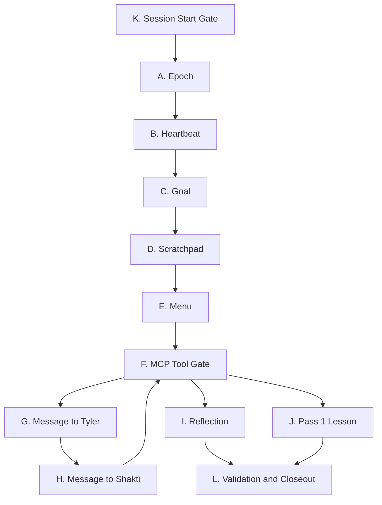

Sections A–I preserve the numbered nine-route architecture. Sections J–L govern the Pass 1 lesson, session gate, proof, completion, and cleanup.

| Section | Governing title | Purpose |
|---|---|---|
| A | Epoch and Event Identity | Assign every action an ordered time identity and permanent log address. |
| B | Heartbeat and Reprompt | Apply Tyler-controlled 0–30 minute continuation timing without imposing route run times. |
| C | Goal and System Message | Keep the active single-stage or multistage Goal resident and record each authorized change. |
| D | Scratchpad and Reminders | Preserve active notes, blockers, immutable reminders, and linked completions. |
| E | Two-Tier Menu | Present capability titles first and the selected description and registry state second. |
| F | MCP Tool Call Gate | Admit, identify, authorize, dispatch, interrupt, resume, and complete registered tool calls. |
| G | Message to Tyler | Deliver a note while work continues or a message that enters the waiting state. |
| H | Message to Shakti | Deliver Tyler’s note or message and release the waiting state when required. |
| I | Reflection | Collect the exact thirteen answers and commit the complete message span as one atomic permanent capsule. |
| J | Pass 1 Four-Channel Lesson | Load one real stone and present its four channels under exact sound-controlled frame state. |
| K | Session Start Gate | Complete every authority, continuity, asset, adapter, state, and test check before implementation begins. |
| L | Validation, Completion, and Cleanup | Save truthful automated and live proof, append completion, and perform approved cleanup. |

# IV. DEFINITIONS

## IV.A. Authority and document terms

| Term | Controlling definition |
|---|---|
| Constitution | This complete document; it governs Pass 1 execution and travels unchanged after approval. |
| Canonical blueprint | `SHAKTI_COMPLETE_BLUEPRINT_CANONICAL.md`; the highest project architecture authority in this handoff. |
| Complete handoff | `SHAKTI_COMPLETE_HANDOFF_V1.zip`; the named baseline containing source, assets, tests, evidence, archive, and blueprint. |
| Authority pair | `SHAKTI_OPUS_CONTEXT_EXPORT.md` and `SHAKTI_SCHEMAS_AND_TEMPLATES_V1.md`; detailed sources for the nine routes and reflection schema. |
| Project section | One permanent A–L constitutional address defined in Section III. |
| Project route | One of the nine numbered runtime routes A–I, corresponding to blueprint items 1–9 and log addresses `Ga`–`Gi`. |
| Plan item | One uniquely named requirement with one observable completion result. |
| Dependency | A required authority, file, function, asset, interface, decision, or completed plan item. |
| Validator | The exact command, test, receipt, or live observation that proves a plan item. |
| Evidence | Saved validator output with an exact path and time identity. |
| Completion record | One append-only Section VII record proving completed plan items, changed files, validators, results, blockers, and restart point. |
| Amendment | One dated, append-only authority entry in Section VII naming the model, target sections, target files, change, reason, validation, and result. |
| Amendment register | The final block in each A–L section that identifies its adoption entry and directs every later change to Section VII. |
| Append-only | Add a new complete record after the last record while preserving every earlier byte and entry. |
| Locked | Approved body text carried forward unchanged. |
| Review draft | A complete proposed Constitution awaiting Tyler’s approval. |
| OPEN | Required work with an identified completion test awaiting saved proof. |
| PASS | A requirement with saved evidence that meets its validator. |
| BLOCKED | Work waiting for a named dependency or direct decision. |
| UNKNOWN | A field whose exact value has no verified source; record the missing source and obtain authority before implementation. |
| Source root | `src/`, `include/`, `tools/`, and `tests/`; only C99 implementation files belong in these roots. |
| XML root | `schemas/`; only controlled XML schemas, tablets, envelopes, manifests, registries, and records belong in this root. |
| Artifact root | `artifacts/`; non-source PNG, WAV, 8×8 text, logs, ledgers, evidence, and document outputs belong below it by class. |
| Repository instruction pointer | The exact two-line `.github/copilot-instructions.md` defined by VI.J.6; it points to this Constitution and adds no competing rules. |
| Instruction evidence branch | `copilot/add-copilot-instructions-file`; the retained source branch whose governing content was incorporated through pull request 2 and this Constitution. |

## IV.B. Runtime and timing terms

| Term | Controlling definition |
|---|---|
| Epoch | Whole epoch seconds forming the first part of an ordered action identity. |
| Subsecond | Three-digit ordered position after epoch under the canonical blueprint. |
| Function order | Two digits `00`–`99` naming the firing order inside a subsection/start order. |
| Tick | `shakti_tick_t`; one `epoch_seconds` value plus one ordered `frame` value. |
| Clock frame | The ordered subsecond field in a tick. |
| Lesson frame | `shakti_frame_t`; the four-corner presentation state. |
| Event identity | The formatted tick plus section and function order used to locate one logged action. |
| Phase A | Opens an action and carries its start time. |
| Phase T | Records a doing step at its actual time. |
| Phase Z | Closes an action, carries finish time, and links to its Phase A record. |
| Awake process | The continuous resident Shakti process that keeps memory and local state available. |
| Cycle | The current `shakti_loop_begin_cycle` through `shakti_loop_finish_cycle` runtime unit. |
| MCP tool call | One admitted registered capability request counted for the governing reflection cadence. |
| Heartbeat | Tyler-configurable 0–30 minute continuation timing checked by the active runtime. |
| Mandatory run time | A fixed minimum or maximum duration assigned to a project route; this Constitution assigns none. |
| Interrupt | Tyler’s external signal that stops tool availability while Shakti remains awake. |
| Completion receipt | The exact adapter result identifying the completed action or WAV filename. |

## IV.C. Memory, message, and reflection terms

| Term | Controlling definition |
|---|---|
| Goal | The resident single-stage or multistage system message. |
| Scratchpad | The active notebook area for current notes and blockers. |
| Note | A message that records information while active work continues. |
| Reminder | An immutable future-point notebook record completed by appending a linked completion record. |
| Message to Tyler | A blocking outbound message that enters `waiting_for_tyler`. |
| Note to Tyler | A continuing outbound note that preserves active work. |
| Message to Shakti | A blocking inbound answer or instruction that releases `waiting_for_tyler`. |
| Note to Shakti | A continuing inbound note that enters memory while work continues. |
| Reflection due point | The tenth approved MCP tool call after the prior completed reflection. |
| Reflection deferral | One of three authorized postponements of a due reflection. |
| Reflection block | The gate requiring reflection completion before the fourteenth approved MCP tool call completes. |
| Reflection candidate | The in-progress set containing the full message span and thirteen responses before atomic commit. |
| Reflection capsule | One immutable permanent block containing every message since the prior completed reflection, chosen title, exact thirteen answers, tags, and selected note/reminder links. |
| Whole-capsule recall | Retrieval of one complete reflection capsule through MCP without splitting its permanent stored identity. |

## IV.D. Learning and presentation terms

| Term | Controlling definition |
|---|---|
| Eden | Resident deterministic foundation and verified fact material. |
| School | Resident learning state containing pass, symbol, streak, attempts, correct results, and errors. |
| Pass 1 | The first complete solo-learning presentation governed by this Constitution. |
| Lesson | One ordered teaching unit containing one or more stones. |
| Tablet | One `SHAKTI_TABLET_4S_V2` XML lesson containing ordered stones. |
| Stone | One ordered four-channel unit containing `text`, `written_text`, `sound_art`, and `visual_art`. |
| `text` | Exact language token or complete displayed word. |
| `written_text` | Exact 8×8 glyph artifact for the token. |
| `visual_art` | Exact visual referent artifact. |
| `sound_art` | Exact WAV filename or ordered pipe-separated WAV sequence. |
| Four-corner frame | Top-left visual art, top-right spoken word/sound state, bottom-left cumulative letters, and bottom-right complete text. |
| Active sound | The one WAV filename currently authorized for playback. |
| Sound-controlled timing | Presentation advancement triggered by real playback completion for the exact active filename. |
| Cumulative letters | Bottom-left spelling state that adds one letter per letter-sound completion and remains through the word. |
| Live adapter | Approved C99 boundary connecting the deterministic core to real audio or display behavior. |
| Convergence | One shared learning identity binding the exact text, character-built writing, visual referent, and sound channel for the same grounded item. |
| Grounded | Proven through an approved solo presentation and saved completion evidence. |
| Parameter | One teachable property or relationship introduced or crossed in a stone, including identity, quantity, character, sound, color, shape, or symbol. |
| New parameter | The single ungrounded property introduced by a Level 2 or later first-exposure stone. |
| Solo tablet | A tablet that introduces one complete new relationship by itself. |
| Crossed tablet | A tablet that combines already grounded roots after every included root completed solo grounding. |
| Character token | One exact character used for writing and external output. |
| Word token | One internal word/concept identity resolving to an ordered sequence of character tokens. |
| Internal drafting | Word-level planning followed by deterministic character-by-character emission. |
| Character-based writing | Written text assembled from the fixed 8×8 character atlas in exact character order. |
| Square visual | A PNG whose width equals height. |
| Canonical visual size | `8×8`, `32×32`, or `64×64`; each dimension is a factor-compatible multiple of the 8×8 foundation. |
| Color swatch | A square PNG containing one approved solid teaching color. |

## IV.E. C type and state elements

| Type | Defined elements and purpose |
|---|---|
| `shakti_channel_t` | Exact channels: `TEXT`, `WRITTEN_TEXT`, `VISUAL_ART`, `SOUND_ART`, and count. |
| `shakti_source_t` | Evidence source: creative, observed, curriculum, verified, or Eden. |
| `shakti_decision_kind_t` | Decision state: unknown, cautious, or known. |
| `shakti_tick_t` | `epoch_seconds`, `frame`. |
| `shakti_tick_clock_t` | `last_epoch_seconds`, `next_frame`. |
| `shakti_fact_t` | `question`, `answer`, `relation`, `source_id`. |
| `shakti_synonym_t` | `variant`, `canonical`. |
| `shakti_evidence_t` | Use state, source, convergence state, confirmations, contradictions, scores, first/converged ticks, question, and answer. |
| `shakti_reason_state_t` | Fixed fact, synonym, and evidence arrays with counts and teaching steps. |
| `shakti_memory_item_t` | Exact text plus tick. |
| `shakti_menu_section_t` | Tier-one `title` plus tier-two `description`. |
| `shakti_memory_state_t` | Fixed working and short-term arrays, resident Goal, notebook, menu, counts, and readiness flags. |
| `shakti_school_state_t` | Pass, mastery target, streak, attempts, correct results, errors, and active symbol. |
| `shakti_stone_t` | Order plus the four exact channel values. |
| `shakti_tablet_t` | Level, lesson, fixed stone array, stone count, and loaded flag. |
| `shakti_manifest_level_t` | Order, level ID, title, and requirements. |
| `shakti_manifest_tablet_t` | Order, level, lesson, mode, requirements, state, and path. |
| `shakti_manifest_t` | Status, artifact root, fixed level/tablet arrays, counts, and loaded flag. |
| `shakti_validation_score_t` | Passed count, required count, percent, and complete flag. |
| `shakti_stone_audit_t` | Four channel results plus validation score. |
| `shakti_tablet_audit_t` | Fixed stone-audit array, count, and combined score. |
| `shakti_loop_state_t` | Heartbeat, next heartbeat epoch, reflection counters, cycle count, route state flags, resident Goal/notebook/menu, and parsed menu sections. |
| `shakti_decision_t` | Decision kind, scores, margin, creative-candidate count, rewrite flag, answer, and reason. |
| `shakti_runtime_t` | Clock, reason, memory, School, loop, tablet, and manifest in one resident runtime. |
| `shakti_frame_phase_t` | Closed, top-right word, bottom-left letter, bottom-right word, or complete. |
| `shakti_frame_t` | Four corner values, active sound, clip array, letter array, indices, counts, open flag, and complete flag. |
| `shakti_report_t` | Stone/tablet counts, missing-channel counts, validation totals, confidence, runnable flag, and Eden-lock readiness. |

## IV.F. Function-contract notation

| Notation | Meaning |
|---|---|
| Input | A value read by the function. |
| Output pointer | Caller-owned storage written by the function. |
| State effect | A named resident structure or file changed by the function. |
| `int` result | `1` means the stated operation completed; `0` means the operation produced no authorized completion. |
| `void` result | The function returns no value; its table entry names its state or display effect. |
| Enum result | The function returns the exact named state. |
| Static function | A file-private implementation function callable only within its source file. |
| Public function | A header-declared function callable by another C translation unit. |

## IV.G. Amendment law

1. Each Section V block ends with its adoption date and Section VII amendment reference.
2. After approval, Sections I–VI remain fixed.
3. Every later amendment appends one complete record to Section VII.
4. Each amendment record names `[DATE]`, `[MODEL]`, `[SECTIONS]`, `[FILES]`, `[CHANGE]`, `[VALIDATORS]`, `[RESULTS]`, and `[EVIDENCE_PATHS]`.
5. A correction appends a new superseding record and cites the earlier amendment ID.
6. Every handoff carries the complete amendment history.

# V. SECTIONS

## A. EPOCH AND EVENT IDENTITY

### A.1. Subsection index — names only

- A.2. Introduction
- A.3. Flow chart
- A.4. Tick clock
- A.5. Event identity and phase
- A.6. Append-only logging
- A.7. Pass 1 completion requirements
- A.8. Amendment register

### A.2. Introduction

Epoch assigns every cycle and action a stable ordered identity. The canonical event key uses epoch, a three-digit subsecond, section, subsection, function order `00`–`99`, and Phase A, T, or Z.

### A.3. Flow chart

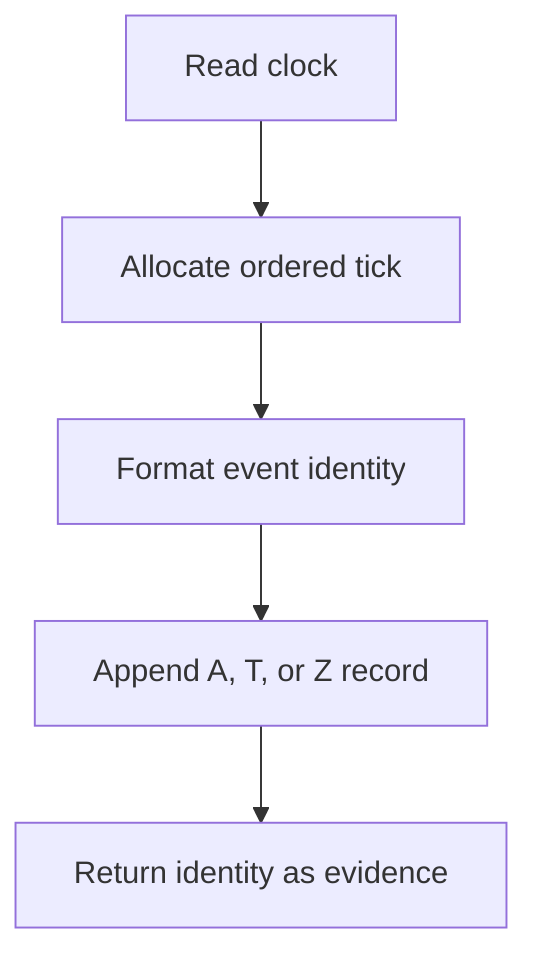

### A.4. Tick clock

**Files:** `include/shakti_time.h`, `src/shakti_time.c`, `include/shakti_types.h`, `include/shakti_config.h`.

| No. | Function | Inputs | Output or state effect |
|---:|---|---|---|
| 1 | `shakti_tick_clock_init(shakti_tick_clock_t *clock_state)` | Output pointer to clock state | Resets the fixed clock state. |
| 2 | `shakti_tick_next(shakti_tick_clock_t *clock_state, shakti_tick_t *tick)` | Clock state; output tick | Writes the next ordered epoch/frame tick; returns completion. |
| 3 | `shakti_tick_format(const shakti_tick_t *tick, char *destination, size_t destination_size)` | Tick; output buffer; capacity | Writes the readable tick; returns completion. |

### A.5. Event identity and phase

**Files:** `include/shakti_time.h`, `src/shakti_time.c`, `include/shakti_log.h`, `src/shakti_log.c`.

| No. | Function | Inputs | Output or state effect |
|---:|---|---|---|
| 1 | `shakti_event_id_format(const shakti_tick_t *tick, const char *section, unsigned int function_order, char *destination, size_t destination_size)` | Tick; section; order; output buffer; capacity | Writes the event ID; returns completion. |
| 2 | `shakti_channel_name(shakti_channel_t channel)` | Channel enum | Returns the exact channel name string. |

Required event law:

1. Format the subsecond with three digits.
2. Accept function order `00`–`99`.
3. Record one Phase A opening row before dispatch.
4. Record each Phase T doing row at its actual tick.
5. Record Phase Z at completion with a link to its Phase A identity.
6. Carry incomplete Phase A records across restart until their true Phase Z arrives.

### A.6. Append-only logging

**Files:** `include/shakti_log.h`, `src/shakti_log.c`, `src/shakti_loop.c`, `src/main.c`, `data/learned/learned_stream.log`.

| No. | Function | Inputs | Output or state effect |
|---:|---|---|---|
| 1 | `fnv1a_text(const char *text)` static | Log text | Returns the current integrity checksum value. |
| 2 | `sanitize_field(const char *source, char *destination, size_t destination_size)` static | Field text; output buffer; capacity | Writes a log-safe field. |
| 3 | `shakti_log_append(...)` | Path, prefix, tick, section, order, phase, channel, subject, property, value | Appends one durable log row; returns completion. |
| 4 | `shakti_log_validate_file(const char *path, unsigned long *valid_lines, unsigned long *invalid_lines)` | Log path; two output counters | Counts valid and invalid rows; returns completion. |
| 5 | `append_loop_log(...)` static | Runtime, path, prefix, section, order, route, subject, property, value, optional output tick | Appends route and learned-memory rows, updates resident memory, and optionally returns the used tick. |
| 6 | `shakti_loop_begin_cycle(shakti_runtime_t *runtime, shakti_tick_t *cycle_tick)` | Runtime; optional output tick | Opens the current cycle, logs `Ga`, and returns completion. |
| 7 | `log_tool_call(shakti_runtime_t *runtime, const char *tool, const char *arguments)` static | Runtime; tool; arguments | Assigns and saves the tool-call log identity. |

### A.7. Pass 1 completion requirements

1. Every Pass 1 event receives one stable ordered identity.
2. Every live adapter request carries its Phase A identity through its completion receipt.
3. Every accepted completion receives Phase Z at the real completion tick.
4. The event-key validator proves three-digit subsecond, `00`–`99` order, and A/T/Z linkage.
5. Saved evidence identifies the exact log path and validated row counts.

### A.8. Amendment register

`2026-08-03` — Section A adopted. Later Section A authority appends only to Section VII with tag `[A]`.

## B. HEARTBEAT AND REPROMPT

### B.1. Subsection index — names only

- B.2. Introduction
- B.3. Flow chart
- B.4. Interval control
- B.5. Due calculation and logging
- B.6. Pass 1 timing law
- B.7. Amendment register

### B.2. Introduction

Heartbeat supplies Tyler-controlled continuation timing from 0 through 30 minutes. Each project route keeps its own condition and receives no mandatory run time.

### B.3. Flow chart

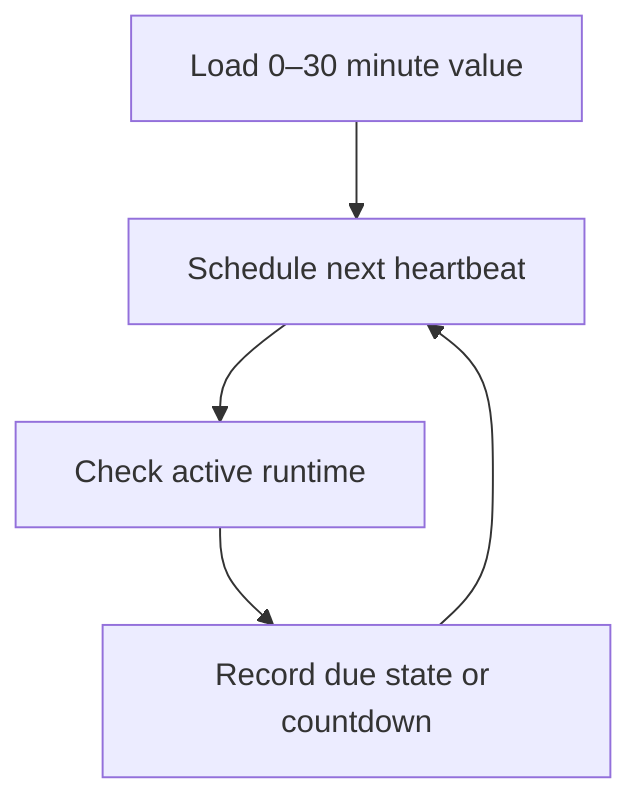

### B.4. Interval control

**Files:** `include/shakti_loop.h`, `src/shakti_loop.c`, `include/shakti_config.h`, `include/shakti_types.h`, `src/main.c`.

| No. | Function | Inputs | Output or state effect |
|---:|---|---|---|
| 1 | `shakti_loop_set_heartbeat(shakti_loop_state_t *state, unsigned int minutes)` | Loop state; minutes `0`–`30` | Stores the interval and reschedules the next heartbeat; returns completion. |
| 2 | `schedule_next_heartbeat(shakti_loop_state_t *state, time_t now)` static | Loop state; current epoch | Writes `next_heartbeat_epoch`. |
| 3 | `parse_unsigned(const char *text, unsigned int *value)` static | Text; output integer | Parses an unsigned control value; returns completion. |
| 4 | `process_control(shakti_runtime_t *runtime, char *line)` static | Runtime; control command | Applies `/heartbeat/` and other control routes; returns command result. |

### B.5. Due calculation and logging

| No. | Function | Inputs | Output or state effect |
|---:|---|---|---|
| 1 | `heartbeat_is_due(shakti_loop_state_t *state, time_t now)` static | Loop state; current epoch | Returns due state. |
| 2 | `shakti_loop_begin_cycle(shakti_runtime_t *runtime, shakti_tick_t *cycle_tick)` | Runtime; optional output tick | Checks heartbeat during the active runtime and records `Gb`. |
| 3 | `shakti_loop_print_status(const shakti_loop_state_t *state)` | Loop state | Prints the configured heartbeat and current route state. |

Required correction: present the configured interval or countdown and omit the repeating `Heartbeat: keep going.` prompt.

### B.6. Pass 1 timing law

1. Heartbeat accepts every integer from 0 through 30 minutes.
2. Tyler may change the value through the control route.
3. Heartbeat timing governs reprompt state only.
4. Real WAV completion governs the Pass 1 lesson frame.
5. Sections A–L receive no fixed mandatory run time.

### B.7. Amendment register

`2026-08-03` — Section B adopted. Later Section B authority appends only to Section VII with tag `[B]`.

## C. GOAL AND SYSTEM MESSAGE

### C.1. Subsection index — names only

- C.2. Introduction
- C.3. Flow chart
- C.4. Goal load
- C.5. Goal change and memory
- C.6. Pass 1 Goal
- C.7. Amendment register

### C.2. Introduction

Goal holds the current single-stage or multistage system message as resident state and records every authorized change in readable memory.

### C.3. Flow chart

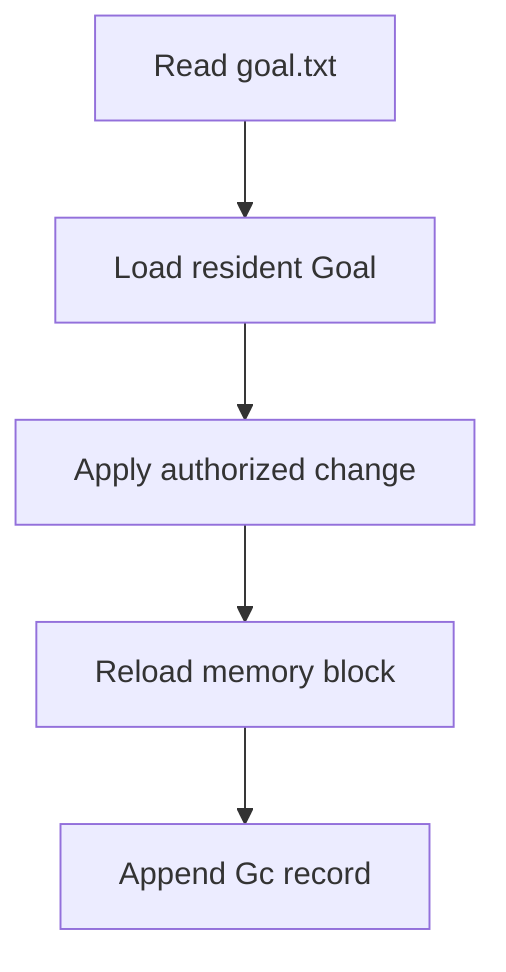

### C.4. Goal load

**Files:** `data/control/goal.txt`, `include/shakti_loop.h`, `src/shakti_loop.c`, `include/shakti_memory.h`, `src/shakti_memory.c`, `include/shakti_types.h`, `src/main.c`.

| No. | Function | Inputs | Output or state effect |
|---:|---|---|---|
| 1 | `shakti_memory_init(shakti_memory_state_t *memory)` | Memory state | Resets fixed memory state. |
| 2 | `shakti_memory_load_always(shakti_memory_state_t *memory, const char *goal_path, const char *notebook_path, const char *menu_path, const char *long_term_path)` | Memory state and four paths | Loads resident blocks and readiness state; returns completion. |
| 3 | `shakti_loop_init(shakti_loop_state_t *state)` | Loop state | Resets loop state and establishes resident defaults. |
| 4 | `shakti_loop_load(shakti_loop_state_t *state, const char *goal_path, const char *notebook_path, const char *menu_path)` | Loop state and three paths | Loads Goal, notebook, and menu; schedules heartbeat; returns completion. |
| 5 | `read_whole_file(const char *path, char *destination, size_t destination_size)` static | Path; output buffer; capacity | Loads one complete text file; returns completion. |

### C.5. Goal change and memory

| No. | Function | Inputs | Output or state effect |
|---:|---|---|---|
| 1 | `write_whole_file(const char *path, const char *text)` static | Path; text | Writes and flushes one complete Goal file; returns completion. |
| 2 | `shakti_memory_reload_goal(shakti_memory_state_t *memory, const char *goal_path)` | Memory state; Goal path | Reloads the locked Goal block; returns completion. |
| 3 | `shakti_loop_set_goal(shakti_runtime_t *runtime, const char *goal)` | Runtime; exact Goal text | Saves Goal, reloads memory, and appends `Gc`; returns completion. |

### C.6. Pass 1 Goal

The resident Pass 1 Goal is:

> Present the real counting stone `one` through one sound-controlled four-corner frame and advance once after the closing `one.wav` completes.

The Goal remains resident during messaging, reflection, tool interruption, testing, and completion recording.

### C.7. Amendment register

`2026-08-03` — Section C adopted. Later Section C authority appends only to Section VII with tag `[C]`.

## D. SCRATCHPAD AND REMINDERS

### D.1. Subsection index — names only

- D.2. Introduction
- D.3. Flow chart
- D.4. Notebook and memory functions
- D.5. Reminder and completion law
- D.6. Pass 1 records
- D.7. Amendment register

### D.2. Introduction

Scratchpad preserves active notes and blockers. Reminders remain immutable and receive linked completion entries.

### D.3. Flow chart

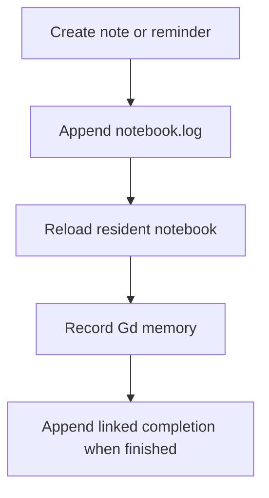

### D.4. Notebook and memory functions

**Files:** `data/control/notebook.log`, `include/shakti_loop.h`, `src/shakti_loop.c`, `include/shakti_memory.h`, `src/shakti_memory.c`, `include/shakti_types.h`, `src/main.c`.

| No. | Function | Inputs | Output or state effect |
|---:|---|---|---|
| 1 | `shakti_loop_notebook(shakti_runtime_t *runtime, const char *entry)` | Runtime; optional entry | Displays the notebook or appends an entry, reloads memory, and records `Gd`; returns completion. |
| 2 | `shakti_memory_reload_notebook(shakti_memory_state_t *memory, const char *notebook_path)` | Memory state; notebook path | Reloads the locked notebook block; returns completion. |
| 3 | `shakti_memory_remember(shakti_memory_state_t *memory, const shakti_tick_t *tick, const char *text)` | Memory state; tick; text | Adds one item to fixed working and short-term memory. |
| 4 | `shakti_memory_recall_text_file(const char *path, const char *term, unsigned int maximum_matches)` | Path; exact term; result limit | Prints matching lines and returns match status. |
| 5 | `shakti_memory_print_status(const shakti_memory_state_t *memory)` | Memory state | Prints resident-memory readiness and counts. |
| 6 | `load_text_file(const char *path, char *destination, size_t destination_size)` static | Path; output buffer; capacity | Loads a complete bounded text file; returns completion. |
| 7 | `readable_file_ready(const char *path)` static | Path | Returns file-readiness state. |

### D.5. Reminder and completion law

1. A reminder records its exact text, creation identity, target condition or epoch, and status `OPEN`.
2. The original reminder remains immutable.
3. Completion appends a new record containing the original reminder identity, completion identity, actual result, and evidence paths.
4. Blockers name the blocked plan item and the exact dependency.
5. Section VII stores constitutional completions; `notebook.log` stores operational reminders and notes.

Required implementation: add the fixed reminder schema, due-state check, immutable creation path, and linked completion path.

### D.6. Pass 1 records

Record every Pass 1 decision, blocker, adapter boundary, compiler result, automated test result, live observation, next item, and restart point.

### D.7. Amendment register

`2026-08-03` — Section D adopted. Later Section D authority appends only to Section VII with tag `[D]`.

## E. TWO-TIER MENU

### E.1. Subsection index — names only

- E.2. Introduction
- E.3. Flow chart
- E.4. Tier-one titles
- E.5. Tier-two descriptions
- E.6. Capability registry
- E.7. Pass 1 requirement
- E.8. Amendment register

### E.2. Introduction

The Menu presents every available capability through a title and a selected description, then supplies the registry state used by the MCP gate.

### E.3. Flow chart

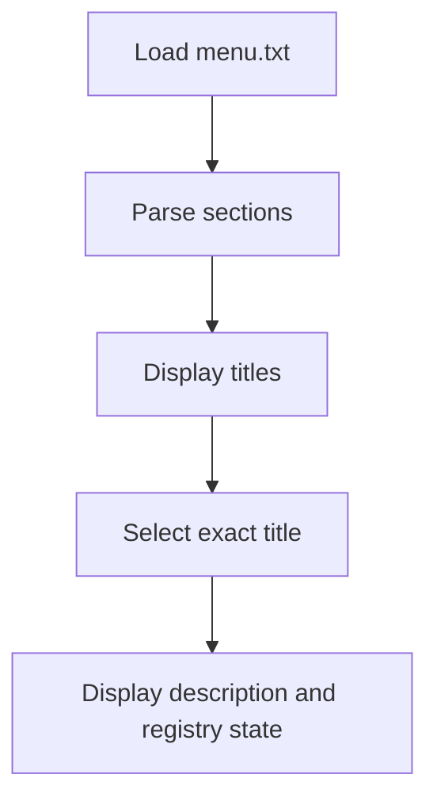

### E.4. Tier-one titles

**Files:** `data/control/menu.txt`, `include/shakti_loop.h`, `src/shakti_loop.c`, `include/shakti_types.h`, `src/main.c`.

| No. | Function | Inputs | Output or state effect |
|---:|---|---|---|
| 1 | `parse_menu(shakti_loop_state_t *state)` static | Loop state containing menu text | Populates fixed menu sections; returns parsed-section status. |
| 2 | `shakti_loop_menu_titles(const shakti_loop_state_t *state)` | Loop state | Prints every exact tier-one title. |

### E.5. Tier-two descriptions

| No. | Function | Inputs | Output or state effect |
|---:|---|---|---|
| 1 | `shakti_loop_menu_section(const shakti_loop_state_t *state, const char *title)` | Loop state; exact title | Prints the selected description; returns match status. |
| 2 | `shakti_loop_load(...)` | Loop state and control-file paths | Loads and parses the menu during runtime initialization. |

### E.6. Capability registry

Each registered capability shall contain:

1. exact title;
2. exact route and parent family;
3. description;
4. C entrypoint or adapter boundary;
5. present state;
6. enabled state controlled by Tyler;
7. per-call permission requirement;
8. input schema;
9. output and completion-receipt schema;
10. interrupt behavior;
11. evidence path.

### E.7. Pass 1 requirement

Register the lesson presenter, audio adapter, four-corner display adapter, completion-receipt path, and their present/enabled/per-call-permitted states before live use.

### E.8. Amendment register

`2026-08-03` — Section E adopted. Later Section E authority appends only to Section VII with tag `[E]`.

## F. MCP TOOL CALL GATE

### F.1. Subsection index — names only

- F.2. Introduction
- F.3. Flow chart
- F.4. Input parsing and command routing
- F.5. Tool dispatch functions
- F.6. Permission gate
- F.7. Interrupt and resume
- F.8. Completion receipt
- F.9. Amendment register

### F.2. Introduction

Every external capability call passes through the internal MCP gate and receives identity, admission, permission, dispatch, completion, and evidence state while Shakti remains awake.

### F.3. Flow chart

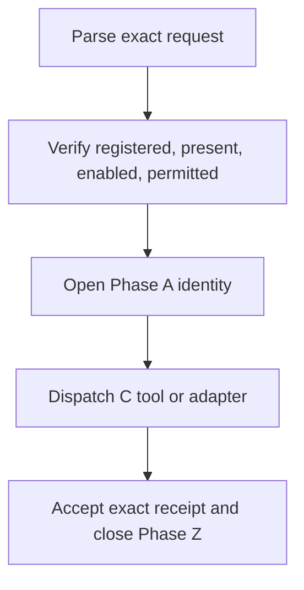

### F.4. Input parsing and command routing

**Files:** `src/main.c`, `include/shakti_types.h`, `include/shakti_config.h`.

| No. | Function | Inputs | Output or state effect |
|---:|---|---|---|
| 1 | `handle_external_interrupt(int signal_number)` static | Host signal number | Sets the external interrupt flag. |
| 2 | `trim_text(char *text)` static | Mutable text | Returns the trimmed start and terminates trailing space. |
| 3 | `split_pipe_fields(char *text, char **fields, size_t field_count)` static | Mutable text; output field pointers; required count | Splits exact pipe fields; returns completion. |
| 4 | `parse_source(const char *text, shakti_source_t *source)` static | Source text; output enum | Parses an exact evidence source; returns completion. |
| 5 | `parse_channel(const char *text, shakti_channel_t *channel)` static | Channel text; output enum | Parses an exact channel; returns completion. |
| 6 | `read_token(const char **cursor, char *destination, size_t destination_size)` static | Cursor; output token; capacity | Reads one bounded command token and advances the cursor. |
| 7 | `copy_remainder(const char *cursor, char *destination, size_t destination_size)` static | Cursor; output text; capacity | Copies the bounded command remainder; returns completion. |
| 8 | `parse_unsigned(const char *text, unsigned int *value)` static | Numeric text; output value | Parses a bounded unsigned value; returns completion. |
| 9 | `process_control(shakti_runtime_t *runtime, char *line)` static | Runtime; mutable control command | Routes Section B–I controls; returns command result. |
| 10 | `process_tool(shakti_runtime_t *runtime, char *command)` static | Runtime; mutable tool command | Routes one admitted tool family command; returns tool result. |

### F.5. Tool dispatch functions

**Files:** `src/main.c`, `src/shakti_reason.c`, `src/shakti_school.c`, `src/shakti_tablet.c`, `src/shakti_manifest.c`, `src/shakti_report.c`, `src/shakti_loop.c`, and their matching headers.

| No. | Function | Inputs | Output or state effect |
|---:|---|---|---|
| 1 | `log_tool_call(shakti_runtime_t *runtime, const char *tool, const char *arguments)` static | Runtime; tool; arguments | Saves the admitted call identity. |
| 2 | `handle_ask(shakti_runtime_t *runtime, const char *question)` static | Runtime; question | Runs deterministic answer logic and prints the decision. |
| 3 | `handle_evidence(shakti_runtime_t *runtime, char *arguments, int contradiction)` static | Runtime; evidence fields; contradiction flag | Records evidence or contradiction and returns completion. |
| 4 | `handle_sense(shakti_runtime_t *runtime, const char *arguments)` static | Runtime; sensory fields | Records a sensed item and returns completion. |
| 5 | `handle_pass(shakti_runtime_t *runtime, const char *arguments)` static | Runtime; pass value | Updates School pass state and returns completion. |
| 6 | `handle_tablet(shakti_runtime_t *runtime, const char *arguments)` static | Runtime; tablet command | Parses, loads, audits, or prints a tablet and returns completion. |
| 7 | `handle_manifest(shakti_runtime_t *runtime, const char *arguments)` static | Runtime; manifest command | Loads, audits, prints, or reports the manifest and returns completion. |
| 8 | `print_decision(const shakti_decision_t *decision)` static | Decision | Prints answer, decision kind, score, and reason. |
| 9 | `validate_logs(void)` static | Defined log paths | Validates runtime logs and returns aggregate completion. |
| 10 | `print_status(const shakti_runtime_t *runtime)` static | Runtime | Prints reason, memory, School, loop, tablet, and manifest status. |
| 11 | `print_help(void)` static | None | Prints exact control and tool commands. |
| 12 | `resolve_manifest_path(...)` static | Manifest path; relative path; output buffer; capacity | Writes the resolved tablet path; returns completion. |
| 13 | `initialize_runtime(shakti_runtime_t *runtime)` static | Runtime | Initializes and loads all resident subsystems; returns completion. |
| 14 | `run_startup_report(shakti_runtime_t *runtime, shakti_report_t *report)` static | Runtime; output report | Runs the startup audit and returns completion. |
| 15 | `write_startup_anchor(shakti_runtime_t *runtime)` static | Runtime | Saves the startup identity and status anchor. |
| 16 | `run_first_lesson_demo(shakti_runtime_t *runtime)` static | Runtime | Loads the first lesson demonstration path and returns completion. |
| 17 | `print_usage(const char *program_name)` static | Executable name | Prints CLI usage. |
| 18 | `main(int argc, char **argv)` | CLI argument count and values | Initializes the process, runs the selected mode, and returns the process exit code. |

#### F.5.a. Deterministic reason-function register

**Files:** `include/shakti_reason.h`, `src/shakti_reason.c`.

| No. | Function | Inputs | Output or state effect |
|---:|---|---|---|
| 1 | `copy_checked(char *destination, size_t destination_size, const char *source)` static | Output buffer; capacity; source | Copies bounded text and returns completion. |
| 2 | `split_fields(char *line, char **fields, size_t field_count)` static | Mutable row; output fields; count | Splits an exact evidence row and returns completion. |
| 3 | `allowed_symbol(unsigned char character)` static | Character | Returns normalization-admission state. |
| 4 | `normalize_basic(const char *input, char *output, size_t output_size)` static | Input; output buffer; capacity | Writes deterministic normalized text and returns completion. |
| 5 | `find_canonical_token(const shakti_reason_state_t *state, const char *token)` static | Reason state; token | Returns the exact canonical token pointer. |
| 6 | `creative_rewrite_question(...)` static | Reason state; basic question; output rewrite; capacity | Writes one grounded synonym rewrite and returns completion. |
| 7 | `evidence_score(const shakti_evidence_t *entry)` static | Evidence entry | Returns its deterministic score. |
| 8 | `same_answer(const char *left, const char *right)` static | Two exact answers | Returns equality state. |
| 9 | `consider_answer(...)` static | Best/second candidates; answer; score | Updates the two deterministic candidate slots. |
| 10 | `evaluate_exact_question(const shakti_reason_state_t *state, const char *question)` static | Reason state; exact question | Returns the deterministic decision. |
| 11 | `count_shared_tokens(const char *left, const char *right)` static | Two texts | Returns the exact shared-token count. |
| 12 | `count_creative_candidates(const shakti_reason_state_t *state, const char *question)` static | Reason state; question | Returns the bounded candidate count. |
| 13 | `find_evidence(shakti_reason_state_t *state, const char *question, const char *answer)` static | Reason state; question; answer | Returns the matching evidence pointer. |
| 14 | `apply_evidence_event(...)` static | State, tick, question, answer, source, contradiction | Updates fixed evidence state and returns completion. |
| 15 | `append_evidence_event(...)` static | Path, tick, question, answer, source, contradiction | Appends one evidence row and returns completion. |
| 16 | `parse_source_name(const char *text, shakti_source_t *source)` static | Source text; output enum | Parses exact source and returns completion. |
| 17 | `parse_tick_text(const char *text, shakti_tick_t *tick)` static | Tick text; output tick | Parses exact tick and returns completion. |
| 18 | `load_facts(shakti_reason_state_t *state, const char *path)` static | Reason state; fact path | Loads bounded facts and returns completion. |
| 19 | `load_synonyms(shakti_reason_state_t *state, const char *path)` static | Reason state; synonym path | Loads bounded synonyms and returns completion. |
| 20 | `load_evidence(shakti_reason_state_t *state, const char *path)` static | Reason state; evidence path | Replays evidence rows and returns completion. |
| 21 | `shakti_reason_init(shakti_reason_state_t *state)` | Reason state | Resets the fixed reasoning state. |
| 22 | `shakti_reason_load(...)` | Reason state; facts, thesaurus, and evidence paths | Loads deterministic reasoning data and returns completion. |
| 23 | `shakti_reason_record_evidence(...)` | State, path, tick, question, answer, source, contradiction | Applies and appends evidence and returns completion. |
| 24 | `shakti_reason_answer(const shakti_reason_state_t *state, const char *question)` | Reason state; question | Returns a complete `shakti_decision_t`. |
| 25 | `shakti_source_name(shakti_source_t source)` | Source enum | Returns the exact source name. |

### F.6. Permission gate

Admit a tool call only when all four states are true:

1. `registered` — exact registry entry exists;
2. `present` — callable implementation or adapter is available;
3. `enabled` — Tyler enabled the capability;
4. `per_call_permitted` — the exact request has permission for this invocation.

The gate returns one structured admission result containing the call identity, capability, four state values, inputs, decision, and evidence path.

### F.7. Interrupt and resume

**Files:** `include/shakti_loop.h`, `src/shakti_loop.c`, `src/main.c`.

| No. | Function | Inputs | Output or state effect |
|---:|---|---|---|
| 1 | `shakti_loop_interrupt_tools(shakti_loop_state_t *state)` | Loop state | Sets `tools_interrupted`; Shakti remains awake. |
| 2 | `shakti_loop_resume_tools(shakti_loop_state_t *state)` | Loop state | Clears `tools_interrupted`. |
| 3 | `shakti_loop_tools_available(const shakti_loop_state_t *state)` | Loop state | Returns tool-availability state. |

### F.8. Completion receipt

1. Preserve the Phase A identity through dispatch.
2. Accept a receipt only from the admitted capability instance.
3. Match the exact action and filename.
4. Reject early, duplicate, mismatched, and post-interrupt receipts.
5. Append Phase Z at the true completion tick.
6. Return the receipt to the calling deterministic state machine.

### F.9. Amendment register

`2026-08-03` — Section F adopted. Later Section F authority appends only to Section VII with tag `[F]`.

## G. MESSAGE TO TYLER

### G.1. Subsection index — names only

- G.2. Introduction
- G.3. Flow chart
- G.4. Note route
- G.5. Message route
- G.6. Memory and wait state
- G.7. Amendment register

### G.2. Introduction

Section G carries Shakti’s outbound communication to Tyler through a continuing note route or a blocking message route.

### G.3. Flow chart

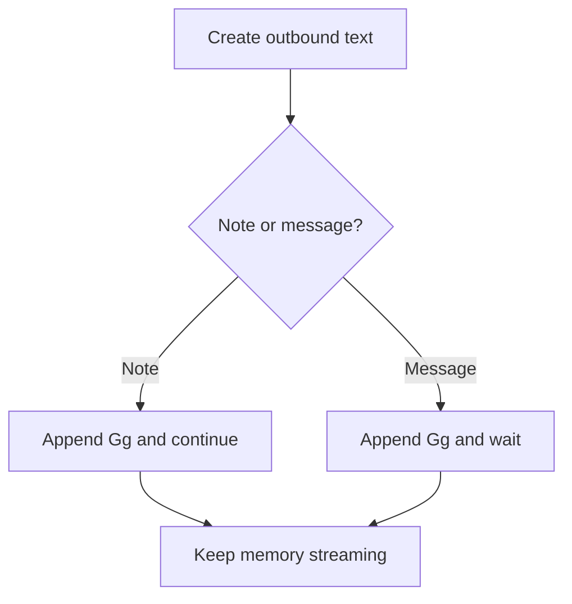

### G.4. Note route

`/note_tyler/ [text]` appends the exact note to `data/control/messages.log`, copies it to readable learned memory, and preserves active work.

### G.5. Message route

`/message_tyler/ [text]` appends the exact message, copies it to readable learned memory, and sets `waiting_for_tyler=1`.

### G.6. Memory and wait state

**Files:** `data/control/messages.log`, `data/learned/learned_stream.log`, `include/shakti_loop.h`, `src/shakti_loop.c`, `include/shakti_types.h`, `src/main.c`.

| No. | Function | Inputs | Output or state effect |
|---:|---|---|---|
| 1 | `shakti_loop_record_message(shakti_runtime_t *runtime, const char *route, const char *text)` | Runtime; exact route; text | Applies Gg/Gh state, appends message and learned-memory rows, and returns completion. |
| 2 | `append_loop_log(...)` static | Runtime and complete log fields | Assigns tick, appends records, and updates resident memory. |
| 3 | `process_control(shakti_runtime_t *runtime, char *line)` static | Runtime; route command | Parses and dispatches `/note_tyler/` or `/message_tyler/`. |

### G.7. Amendment register

`2026-08-03` — Section G adopted. Later Section G authority appends only to Section VII with tag `[G]`.

## H. MESSAGE TO SHAKTI

### H.1. Subsection index — names only

- H.2. Introduction
- H.3. Flow chart
- H.4. Note route
- H.5. Message route
- H.6. Decision admission
- H.7. Amendment register

### H.2. Introduction

Section H carries Tyler’s inbound communication to Shakti through a continuing note route or a message route that releases the waiting state.

### H.3. Flow chart

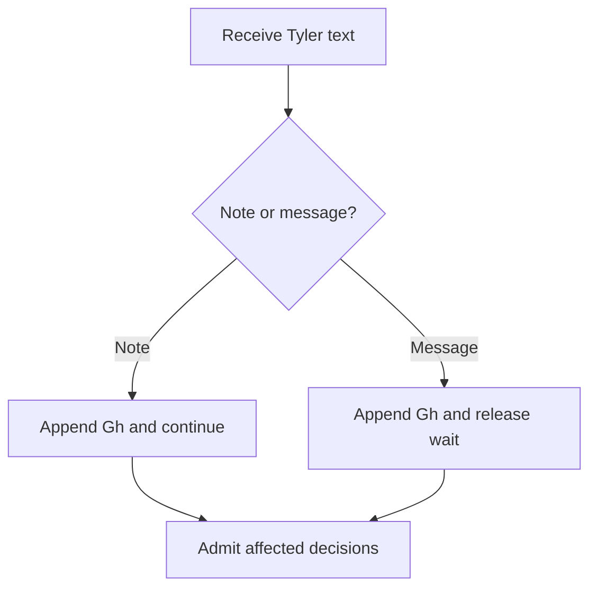

### H.4. Note route

`/note_shakti/ [text]` appends Tyler’s note to message and learned memory while active work continues.

### H.5. Message route

`/message_shakti/ [text]` appends Tyler’s message and sets `waiting_for_tyler=0`.

### H.6. Decision admission

**Files:** `data/control/messages.log`, `data/learned/learned_stream.log`, `include/shakti_loop.h`, `src/shakti_loop.c`, `include/shakti_types.h`, `src/main.c`, this Constitution.

| No. | Function | Inputs | Output or state effect |
|---:|---|---|---|
| 1 | `shakti_loop_record_message(...)` | Runtime; `message_shakti` or `note_shakti`; text | Appends `Gh`, updates memory, and applies the wait state. |
| 2 | `process_control(...)` static | Runtime; route command | Parses and dispatches the inbound route. |

For each controlling instruction:

1. write one concise decision;
2. assign one decision ID;
3. link every affected constitutional section and plan item;
4. update the active work packet;
5. record the required validator;
6. mark the decision admitted before implementation continues;
7. append the resulting file change and proof to Section VII.

### H.7. Amendment register

`2026-08-03` — Section H adopted. Later Section H authority appends only to Section VII with tag `[H]`.

## I. REFLECTION

### I.1. Subsection index — names only

- I.2. Introduction
- I.3. Flow chart
- I.4. Cadence, deferral, and block
- I.5. Exact thirteen questions
- I.6. Atomic capsule and recall
- I.7. Function register
- I.8. Amendment register

### I.2. Introduction

Reflection converts the complete message span and exact thirteen answers into one permanent atomic memory capsule while the active Goal remains resident.

### I.3. Flow chart

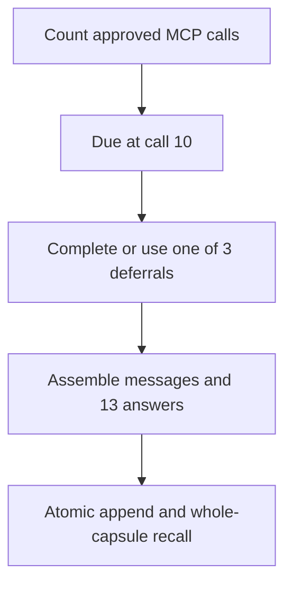

### I.4. Cadence, deferral, and block

1. Count completed approved MCP tool calls.
2. Set reflection due at call 10.
3. Permit three deferrals.
4. Require reflection completion before call 14 completes.
5. Reset the approved-call counter and deferrals after atomic commit.
6. Keep the current Goal resident above reflection.

Required implementation: drive cadence from approved MCP calls, assemble the candidate in fixed storage, commit once, and expose whole-capsule recall through MCP.

### I.5. Exact thirteen questions

1. Title the last 10 cycles
2. Summary
3. Did I finish — if no, the reason
4. Was it successful
5. If I was to redo it, what would I do different
6. Tools used
7. What tools would have helped
8. What could Tyler have done different to help
9. What files did I save, and their paths
10. Memories recalled that helped, by the epoch of the first memory in the batch
11. Notes
12. Meta tags for auto-search — shoot for 15
13. Cross reference — override all additional memory sets to link this to:

The question text remains exact and versioned.

### I.6. Atomic capsule and recall

One capsule contains:

1. every message since the previous completed reflection;
2. the chosen title;
3. all thirteen answers;
4. the chosen tags;
5. selected links to notes or reminders;
6. opening Phase A identity;
7. closing Phase Z identity;
8. capsule checksum and permanent path.

Response 1 opens the candidate. Responses 2–12 remain in the same fixed candidate. Response 13 closes the candidate and commits the whole block. MCP recall returns the whole capsule.

### I.7. Function register

**Files:** `data/control/reflections.log`, `data/control/messages.log`, `data/learned/learned_stream.log`, `include/shakti_loop.h`, `src/shakti_loop.c`, `include/shakti_config.h`, `include/shakti_types.h`, `src/main.c`.

| No. | Function | Inputs | Output or state effect |
|---:|---|---|---|
| 1 | `shakti_loop_finish_cycle(shakti_runtime_t *runtime)` | Runtime | Advances the current cadence state and appends `Gi`; returns completion. |
| 2 | `shakti_loop_defer_reflection(shakti_loop_state_t *state)` | Loop state | Uses one authorized deferral; returns completion. |
| 3 | `shakti_loop_print_reflection_questions(FILE *output)` | Output stream | Prints the exact thirteen questions. |
| 4 | `shakti_loop_run_reflection(shakti_runtime_t *runtime, FILE *input, FILE *output)` | Runtime; answer stream; prompt stream | Collects answers, writes reflection records, and resets current counters; returns completion. |
| 5 | `shakti_loop_print_status(const shakti_loop_state_t *state)` | Loop state | Prints due state, cadence, deferrals, tool state, wait state, and memory state. |
| 6 | `shakti_memory_recall_text_file(...)` | Capsule path; search term; match limit | Current text recall entrypoint; returns match status. |

### I.8. Amendment register

`2026-08-03` — Section I adopted. Later Section I authority appends only to Section VII with tag `[I]`.

## J. PASS 1 FOUR-CHANNEL LESSON

### J.1. Subsection index — names only

- J.2. Introduction
- J.3. Flow chart
- J.4. Exact Pass 1 input and presentation
- J.4.a. Training and grounding law
- J.4.b. PNG convergence law
- J.5. Tablet parsing and audit functions
- J.6. Asset identity and validation functions
- J.7. Frame-state functions
- J.8. Handwriting and School functions
- J.9. Curriculum and WAV tool functions
- J.10. Live adapter contract
- J.11. Pass 1 completion requirements
- J.12. Amendment register

### J.2. Introduction

Section J presents one real stone through one four-channel frame. The exact active WAV controls every state transition, cumulative letters remain visible through the word, and the frame advances once after the closing whole-word receipt.

### J.3. Flow chart

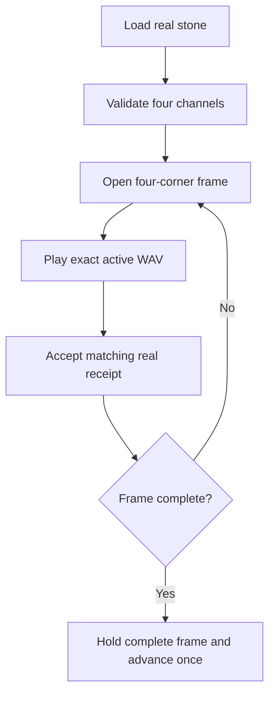

### J.4. Exact Pass 1 input and presentation

**Input tablet:** `data/eden/XML_text/01_counting_zero_to_ten_solo.xml`  
**Stone:** `order="2"`

```xml
<stone order="2">
  <text>one</text>
  <written_text>one.8x8.txt</written_text>
  <sound_art>one.wav|o.wav|n.wav|e.wav|one.wav</sound_art>
  <visual_art>one.png</visual_art>
  <numeral>1</numeral>
  <quantity>1</quantity>
</stone>
```

| Corner | Exact state |
|---|---|
| Top-left | `visual_art`: `one.png` |
| Top-right | Spoken word or active sound state: `One` |
| Bottom-left | Cumulative letters: `O`, then `O N`, then `O N E` |
| Bottom-right | Complete text: `One` |

Sound order:

1. `one.wav`
2. `o.wav`
3. `n.wav`
4. `e.wav`
5. `one.wav`

Every Pass 1 WAV shall contain at least 0.2 seconds before speech and at least 0.2 seconds after speech. Existing 8×8 `uint64_t` glyph identity controls written presentation, using black until color is taught.

The organized repository baseline uses `one.svg`. Pass 1 live completion requires the same convergence migrated atomically to `one.png`, with its tablet, manifest, validator, and proof updated in one work packet.

#### J.4.a. Training and grounding law

1. Before Level 2, Foundation and Counting establish the primitive character, sound, quantity, and visual roots required by later lessons.
2. Beginning at Level 2, each first-exposure stone introduces exactly one new parameter.
3. Every other parameter in that stone shall already be grounded.
4. Present the complete new relationship solo before crossing.
5. Build crossed tablets only from roots with completed grounding evidence.
6. Keep word-based tokens internal as concepts and ordered character sequences.
7. Draft at the word level and emit writing through exact character tokens.
8. Build written words character-by-character from the fixed 8×8 atlas.

#### J.4.b. PNG convergence law

1. Use PNG as the target `visual_art` container for new and migrated training visuals.
2. Use the same case-sensitive canonical basename across each convergence: `KEY.8x8.txt`, `KEY.wav`, and `KEY.png`.
3. Keep spelling sequences as references to grounded atomic WAV files under the same basename law.
4. Make every picture square when the subject permits a square canvas.
5. Use `8×8`, `32×32`, or `64×64` for writing, shapes, symbols, and color swatches.
6. Preserve the 8×8 character source identity when scaling writing to 32×32 or 64×64.
7. Migrate each existing SVG by creating and validating the matching PNG, updating the tablet and manifest in one work packet, and saving before/after evidence.
8. Keep `SHAKTI_TABLET_4S_V2` as the active schema ID until a direct amendment authorizes another ID.

### J.5. Tablet parsing and audit functions

**Files:** `include/shakti_tablet.h`, `src/shakti_tablet.c`, `include/shakti_types.h`, `include/shakti_config.h`, `data/eden/XML_text/01_counting_zero_to_ten_solo.xml`.

| No. | Function | Inputs | Output or state effect |
|---:|---|---|---|
| 1 | `trim_text(char *text)` static | Mutable XML line | Returns trimmed line start and terminates trailing space. |
| 2 | `xml_unescape(const char *source, char *destination, size_t destination_size)` static | Encoded XML text; output buffer; capacity | Writes unescaped text; returns completion. |
| 3 | `extract_tag(const char *line, const char *tag, char *destination, size_t destination_size)` static | XML line; tag; output buffer; capacity | Writes one exact tag value; returns match status. |
| 4 | `extract_order(const char *line, const char *element, unsigned int *order)` static | XML line; element; output order | Writes the positive order; returns match status. |
| 5 | `sound_sequence_visit(const char *sequence, int (*visitor)(const char *, void *), void *context)` static | Pipe sequence; optional visitor; context | Validates each clip and applies the visitor; returns completion. |
| 6 | `validate_sound_contract(const shakti_stone_t *stone)` static | Stone | Returns filename/sequence contract status. |
| 7 | `validate_filename_contract(const shakti_stone_t *stone)` static | Stone | Returns four-channel canonical filename status. |
| 8 | `validate_sound_clip(const char *clip, void *context)` static | Clip; artifact-root context | Returns WAV artifact validation status. |
| 9 | `validate_sound_artifacts(const shakti_stone_t *stone, const char *artifact_root)` static | Stone; artifact root | Returns all sound-artifact status. |
| 10 | `validate_artifacts(const shakti_stone_t *stone, const char *artifact_root, int sound_required)` static | Stone; artifact root; sound rule | Returns required artifact status. |
| 11 | `shakti_tablet_init(shakti_tablet_t *tablet)` | Tablet state | Resets the fixed tablet. |
| 12 | `shakti_tablet_load_internal(shakti_tablet_t *tablet, const char *xml_path, const char *artifact_root, int require_artifacts)` static | Tablet; XML path; artifact root; validation rule | Parses ordered stones and optionally validates artifacts; returns completion. |
| 13 | `shakti_tablet_parse(shakti_tablet_t *tablet, const char *xml_path)` | Tablet; XML path | Parses schema and stones; returns completion. |
| 14 | `shakti_tablet_load(shakti_tablet_t *tablet, const char *xml_path, const char *artifact_root)` | Tablet; XML path; artifact root | Parses and validates the complete tablet; returns completion. |
| 15 | `shakti_tablet_audit(const shakti_tablet_t *tablet, const char *artifact_root, shakti_tablet_audit_t *audit)` | Loaded tablet; artifact root; output audit | Writes per-stone and total validation scores; returns completion. |
| 16 | `shakti_tablet_print(const shakti_tablet_t *tablet)` | Tablet | Prints level, lesson, and each ordered four-channel stone. |

### J.6. Asset identity and validation functions

**Files:** `include/shakti_asset.h`, `src/shakti_asset.c`, `include/shakti_artifact.h`, `src/shakti_artifact.c`, target `artifacts/writing/8x8/`, `artifacts/visual/png/`, `artifacts/audio/wav/`; legacy migration inputs `eden_out/Visual_text/`, `eden_out/Visual_art/`, `eden_out/Sound_art/`.

| No. | Function | Inputs | Output or state effect |
|---:|---|---|---|
| 1 | `append_character(...)` static | Output key; capacity; used count; character | Appends one canonical character; returns completion. |
| 2 | `append_text(...)` static | Output key; capacity; used count; text | Appends bounded key text; returns completion. |
| 3 | `shakti_asset_key_from_text(const char *text, char *destination, size_t destination_size)` | Token text; output key; capacity | Writes the exact canonical asset key; returns completion. |
| 4 | `shakti_asset_filename(const char *text, const char *extension, char *destination, size_t destination_size)` | Token; extension; output filename; capacity | Writes canonical filename; returns completion. |
| 5 | `shakti_asset_safe_filename(const char *filename)` | Filename | Returns path-safe exact filename status. |
| 6 | `read_u16_le(const unsigned char *bytes)` static | Two little-endian bytes | Returns a 16-bit value. |
| 7 | `read_u32_le(const unsigned char *bytes)` static | Four little-endian bytes | Returns a 32-bit value. |
| 8 | `shakti_artifact_join(const char *root, const char *directory, const char *filename, char *destination, size_t destination_size)` | Root; directory; filename; output path; capacity | Writes a safe artifact path; returns completion. |
| 9 | `shakti_artifact_validate_written_text(const char *path, const char *expected_text)` | Artifact path; expected token | Returns exact 8×8 text-artifact status. |
| 10 | `shakti_artifact_validate_svg(const char *path)` legacy migration input | SVG path | Returns SVG structure status until every referenced SVG has a validated PNG replacement. |
| 11 | `shakti_artifact_validate_wav(const char *path)` | WAV path | Returns RIFF/WAVE format and required audio-property status. |

The XML example in J.4 records the required Pass 1 `one.png` target. The current repository `one.svg` is a migration input and cannot satisfy live Pass 1 completion.

PNG migration shall add these C99 interfaces:

| No. | Target function | Inputs | Output or state effect |
|---:|---|---|---|
| 1 | `shakti_artifact_validate_png(const char *path, unsigned int *width, unsigned int *height)` | PNG path; output dimensions | Verifies PNG signature, IHDR, integrity, square rule, and approved dimensions; returns completion. |
| 2 | `shakti_png_write_square(const char *path, unsigned int size, const unsigned char *rgba, size_t rgba_size)` | Output path; `8`, `32`, or `64`; RGBA pixels; byte count | Writes one deterministic dependency-free PNG and returns completion. |
| 3 | `shakti_png_scale_8x8(const uint64_t glyph, unsigned int size, const unsigned char foreground[4], const unsigned char background[4], unsigned char *rgba, size_t rgba_size)` | 8×8 glyph; target size; colors; output pixels | Scales exact glyph cells to 8×8, 32×32, or 64×64 RGBA pixels and returns completion. |

Update `shakti_tablet.c`, `shakti_artifact.c`, the C builders, manifest ledger, tests, and every affected tablet together when PNG becomes live.

### J.7. Frame-state functions

**Files:** `include/shakti_frame.h`, `src/shakti_frame.c`, `include/shakti_types.h`, `include/shakti_config.h`.

| No. | Function | Inputs | Output or state effect |
|---:|---|---|---|
| 1 | `copy_text(char *destination, size_t destination_size, const char *source)` static | Output buffer; capacity; source | Copies exact bounded text; returns completion. |
| 2 | `split_sound_sequence(const char *sequence, shakti_frame_t *frame)` static | Pipe sequence; frame | Writes ordered clip array and count; returns completion. |
| 3 | `collect_letters(const char *text, shakti_frame_t *frame)` static | Token text; frame | Writes ordered non-space letters and count; returns completion. |
| 4 | `validate_sound_sequence(const shakti_stone_t *stone, const shakti_frame_t *frame)` static | Stone; frame | Returns whole-word/letter/whole-word sequence status. |
| 5 | `append_letter(shakti_frame_t *frame, size_t letter_index)` static | Frame; letter index | Appends one spaced cumulative letter; returns completion. |
| 6 | `shakti_frame_init(shakti_frame_t *frame)` | Frame | Resets the fixed frame. |
| 7 | `shakti_frame_open(shakti_frame_t *frame, const shakti_stone_t *stone)` | Frame; real stone | Loads four-corner state and first active sound; returns completion. |
| 8 | `shakti_frame_phase(const shakti_frame_t *frame)` | Frame | Returns the exact frame phase enum. |
| 9 | `shakti_frame_sound_completed(shakti_frame_t *frame, const char *completed_sound)` | Frame; exact completed filename | Accepts only the active sound, updates cumulative state, and returns transition status. |

Frame transition law:

1. Open from the real stone.
2. Render all four corners from `shakti_frame_t`.
3. Play only `active_sound`.
4. Receive completion from the real audio adapter.
5. Pass that exact filename to `shakti_frame_sound_completed`.
6. Re-render the updated cumulative state.
7. Hold the same frame through the closing whole-word completion.
8. Advance the stone index once after `complete=1`.

### J.8. Handwriting and School functions

**Files:** `include/shakti_handwriting.h`, `src/shakti_handwriting.c`, `include/shakti_school.h`, `src/shakti_school.c`, `data/school/school_state.log`.

| No. | Function | Inputs | Output or state effect |
|---:|---|---|---|
| 1 | `find_entry(unsigned char character)` static | Exact character | Returns the fixed font entry pointer. |
| 2 | `shakti_handwriting_render_char(unsigned char character, char rows[8][9])` | Character; output rows | Writes the 8×8 glyph rows; returns completion. |
| 3 | `shakti_handwriting_supports_text(const char *text)` | Text | Returns complete glyph-coverage status. |
| 4 | `shakti_handwriting_write_text_artifact(const char *text, const char *path)` | Text; output path | Writes and flushes the complete 8×8 artifact; returns completion. |
| 5 | `shakti_school_init(shakti_school_state_t *state)` | School state | Resets School and mastery target. |
| 6 | `shakti_school_load(shakti_school_state_t *state, const char *path)` | School state; history path | Loads current School state; returns completion. |
| 7 | `shakti_school_set_pass(shakti_school_state_t *state, const char *path, const shakti_tick_t *tick, unsigned int pass)` | School; path; tick; pass | Saves the selected pass; returns completion. |
| 8 | `shakti_school_record_trial(shakti_school_state_t *state, const char *path, const shakti_tick_t *tick, const char *symbol, int correct)` | School; path; tick; symbol; result | Updates streak and totals and appends trial history. |
| 9 | `shakti_school_run_drill(shakti_runtime_t *runtime, const char *symbol)` | Runtime; symbol | Runs the interactive fixed-state drill; returns completion. |
| 10 | `shakti_school_show_written_text_pixels(const char *text)` | Text | Renders and prints exact glyph pixels; returns completion. |
| 11 | `shakti_school_draft_snapshots(shakti_runtime_t *runtime, const char *text)` | Runtime; text | Produces deterministic teaching snapshots; returns completion. |
| 12 | `append_school_line(...)` static | Path, tick, event, symbol, pass, streak | Appends one School history line; returns completion. |
| 13 | `reward_for_streak(unsigned int streak)` static | Streak | Returns the exact reward string. |
| 14 | `show_trial_progress(...)` static | School; trial result | Prints progress. |
| 15 | `show_mastery_reward(...)` static | School | Prints the mastery result. |
| 16 | `print_drill_status(...)` static | Runtime | Prints current drill state. |
| 17 | `print_drill_controls(void)` static | None | Prints drill controls. |
| 18 | `handle_drill_control(...)` static | Runtime; input | Returns the exact drill-control result enum. |

### J.9. Curriculum and WAV tool functions

**Files:** `tools/build_xml.c`, `tools/build_seed_curriculum.c`, `tools/pad_wav.c`, `tools/build_ledger.c`, `tests/make_wav_fixture.c`, `Makefile`.

#### J.9.a. `tools/build_xml.c`

| No. | Function | Inputs | Output or state effect |
|---:|---|---|---|
| 1 | `trim_line_ending(char *text)` static | Mutable line | Removes line ending and returns text. |
| 2 | `xml_write_escaped(FILE *file, const char *text)` static | Output stream; text | Writes escaped XML; returns completion. |
| 3 | `count_stones(FILE *list, size_t *count)` static | Token list; output count | Counts valid stones; returns completion. |
| 4 | `write_tag(FILE *file, const char *indent, const char *tag, const char *value)` static | Stream and tag fields | Writes one XML tag; returns completion. |
| 5 | `write_stone(FILE *output, const char *artifact_root, const char *text, size_t order)` static | XML stream; root; token; order | Writes one canonical four-channel stone; returns completion. |
| 6 | `main(int argc, char **argv)` | CLI inputs | Builds one XML tablet and returns process status. |

#### J.9.b. `tools/build_seed_curriculum.c`

| No. | Function | Inputs | Output or state effect |
|---:|---|---|---|
| 1 | `xml_write_escaped`, `write_tag` static | Output stream and XML values | Write escaped XML content and return completion. |
| 2 | `append_text`, `append_sound_clip` static | Bounded destination and source text/clip | Append exact bounded sequence text and return completion. |
| 3 | `append_character_sound`, `append_character_sound_sequence` static | Character or text; output sequence | Append canonical character WAV names and return completion. |
| 4 | `make_character_sound_sequence` static | Text; output sequence | Builds the ordered character-sound sequence. |
| 5 | `make_word_spelling_sound_sequence` static | Word; output sequence | Builds whole-word/letters/whole-word sequence. |
| 6 | `write_handwriting_svg` static, legacy migration input | Text; output path | Current SVG writer to replace with the approved C99 PNG writer. |
| 7 | `write_counting_svg` static, legacy migration input | Quantity; word; output path | Current counting SVG writer to replace with the approved C99 PNG writer. |
| 8 | `prepare_text_artifacts` static | Text; artifact root; output filenames | Creates canonical written and visual artifacts. |
| 9 | `write_stone_header` static | Stream; order; four channel values | Writes one stone header and channels. |
| 10 | `write_tablet_start`, `finish_tablet` static | Stream; lesson fields or final status | Open and close one tablet document. |
| 11 | `build_ascii` static | XML path; artifact root | Builds the foundation ASCII tablet. |
| 12 | `build_counting` static | XML path; lesson; artifact root | Builds the counting tablet. |
| 13 | `build_alphabet_solo` static | XML path; lesson; root; first character | Builds an ordered solo alphabet tablet. |
| 14 | `build_case_pairs_and_counting` static | XML path; artifact root | Builds case-pair/counting crossing tablet. |
| 15 | `write_sequence_stone` static | Stream; order; text; sequence kind/length; root | Writes one growing-sequence stone. |
| 16 | `build_growing_sequences` static | XML path; artifact root | Builds the growing alphabet tablet. |
| 17 | `join_xml_path` static | Output buffer; root; filename | Writes one XML path; returns completion. |
| 18 | `main(int argc, char **argv)` | CLI inputs | Builds the staged seed curriculum and returns process status. |

#### J.9.c. `tools/pad_wav.c`

| No. | Function | Inputs | Output or state effect |
|---:|---|---|---|
| 1 | `read_le16`, `read_le32` static | Little-endian bytes | Return decoded WAV integers. |
| 2 | `write_le32` static | Output bytes; value | Writes a little-endian 32-bit value. |
| 3 | `seek_forward` static | Stream; byte count | Advances the stream and returns completion. |
| 4 | `scan_wav` static | WAV stream; output info | Parses chunks and writes WAV metadata. |
| 5 | `padding_bytes` static | WAV info | Returns required 0.2-second padding bytes. |
| 6 | `range_is_zero` static | Stream; offset; count | Returns silence-range status. |
| 7 | `already_padded` static | Stream; WAV info; padding size | Returns edge-padding compliance. |
| 8 | `copy_bytes` static | Input; output; byte count | Copies exact bytes and returns completion. |
| 9 | `write_zeros` static | Output; byte count | Writes exact silence bytes and returns completion. |
| 10 | `rewrite_with_padding` static | WAV path; padding size | Rewrites one WAV with edge silence and returns completion. |
| 11 | `pad_file` static | WAV path | Returns padded, skipped, or failed result. |
| 12 | `has_wav_extension` static | Filename | Returns WAV-extension status. |
| 13 | `process_directory` static | Directory; output padded/skipped counts | Processes all WAV files and returns completion. |
| 14 | `main(int argc, char **argv)` | CLI path | Pads the selected WAV file or directory and returns process status. |

#### J.9.d. Supporting executable entrypoints

| No. | Function | Inputs | Output or state effect |
|---:|---|---|---|
| 1 | `tools/build_ledger.c: main(int argc, char **argv)` | Manifest, artifact, and ledger CLI paths | Builds the manifest ledger and returns process status. |
| 2 | `tests/make_wav_fixture.c: write_u16(FILE *, uint16_t)` static | Stream; value | Writes one little-endian 16-bit test value. |
| 3 | `tests/make_wav_fixture.c: write_u32(FILE *, uint32_t)` static | Stream; value | Writes one little-endian 32-bit test value. |
| 4 | `tests/make_wav_fixture.c: main(int argc, char **argv)` | Output path and fixture arguments | Writes a deterministic WAV fixture and returns process status. |

### J.10. Live adapter contract

The audio adapter shall accept `{event_id, active_sound, absolute_asset_path}` and return `{event_id, completed_sound, completion_tick, adapter_status}`. The display adapter shall accept the complete `shakti_frame_t` presentation state and return `{event_id, rendered_state, render_tick, adapter_status}`.

Both adapters shall be registered, present, enabled, and permitted for each call through Section F.

### J.11. Pass 1 completion requirements

1. Load the real `one` stone from the staged counting tablet.
2. Verify all four channel assets.
3. Open `shakti_frame_t` from that stone.
4. Render all four corners.
5. Play `one.wav`, `o.wav`, `n.wav`, `e.wav`, `one.wav` in exact order.
6. Reveal `O`, `O N`, and `O N E` from exact completion receipts.
7. Keep the frame open through the closing `one.wav`.
8. Advance the next stone exactly once.
9. Save live screen-and-speaker evidence.

### J.12. Amendment register

`2026-08-03` — Section J adopted. Later Section J authority appends only to Section VII with tag `[J]`.

## K. SESSION START GATE

### K.1. Subsection index — names only

- K.2. Introduction
- K.3. Flow chart
- K.4. Authority and continuity gate
- K.5. Decision-admission gate
- K.6. Nine-section readiness gate
- K.7. Asset and frame gate
- K.8. Adapter gate
- K.9. Session admission rule
- K.10. Amendment register

### K.2. Introduction

Section K is the required pre-session process. Implementation begins only after every applicable row is checked, every failed row names its blocker, and the exact restart point is recorded.

### K.3. Flow chart

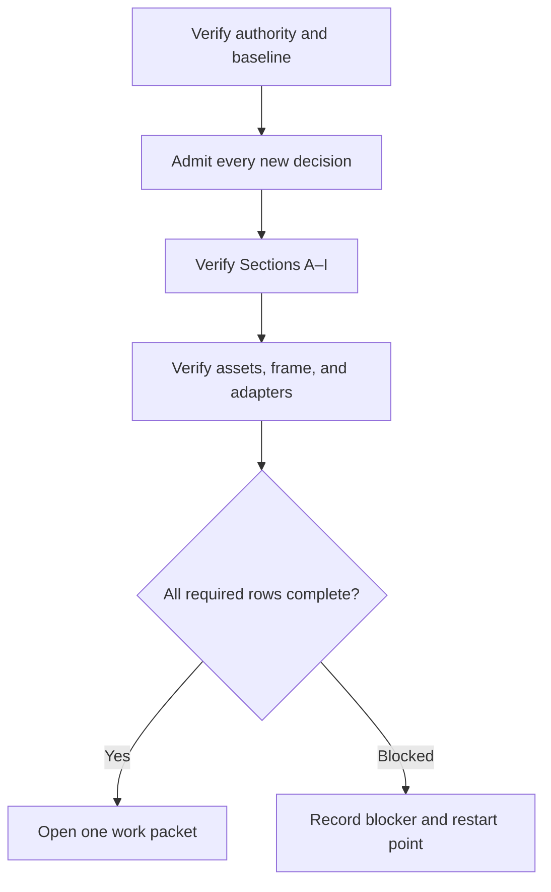

### K.4. Authority and continuity gate

- [ ] `PASS1-START-001` Verify the complete handoff SHA-256 against Section I.D.
- [ ] `PASS1-START-002` Verify `HANDOFF_MANIFEST_SHA256.txt` against the extracted tree.
- [ ] `PASS1-START-003` Verify the canonical blueprint SHA-256 against Section I.D.
- [ ] `PASS1-START-004` Verify the two detailed authority files against Section I.D.
- [ ] `PASS1-START-005` Read this Constitution.
- [ ] `PASS1-START-006` Read every Section VII amendment and completion record.
- [ ] `PASS1-START-007` Record `Shakti-main`, its exact commit, the most recent `copilot/` source branch, and every unexplained changed file.
- [ ] `PASS1-START-008` Verify the one-file repository instruction pointer and the separate C99, XML, and artifact roots.
- [ ] `PASS1-START-009` Record the previous exact restart point.
- [ ] `PASS1-START-010` Confirm that the active work remains inside Pass 1.

### K.5. Decision-admission gate

- [ ] `PASS1-MSG-001` Capture every new controlling instruction since the last Section VII record.
- [ ] `PASS1-MSG-002` Write one concise controlling decision for each instruction.
- [ ] `PASS1-MSG-003` Assign each decision a stable decision ID.
- [ ] `PASS1-MSG-004` Link each decision to every affected constitutional section and plan item.
- [ ] `PASS1-MSG-005` Apply each decision to the active work packet.
- [ ] `PASS1-MSG-006` Mark each decision admitted with its validator.
- [ ] `PASS1-MSG-007` Begin implementation after all new decisions are admitted.

### K.6. Nine-section readiness gate

- [ ] `PASS1-PART-001` Verify Section A Epoch files, state, event format, and log output.
- [ ] `PASS1-PART-002` Set Section B heartbeat value and countdown behavior.
- [ ] `PASS1-PART-003` Load the exact Section C Pass 1 Goal.
- [ ] `PASS1-PART-004` Load Section D notes, reminders, blockers, and linked completions.
- [ ] `PASS1-PART-005` Verify Section E Pass 1 capabilities and registry state.
- [ ] `PASS1-PART-006` Verify Section F MCP admission, permission, and interrupt state.
- [ ] `PASS1-PART-007` Verify Section G outbound logging and waiting behavior.
- [ ] `PASS1-PART-008` Verify Section H inbound logging, decision admission, and release behavior.
- [ ] `PASS1-PART-009` Verify Section I approved-call count, deferrals, block, candidate, and capsule state.

### K.7. Asset and frame gate

- [ ] `P1-AUDIO-01` Verify every Pass 1 WAV has at least 0.2 seconds before and after speech.
- [ ] `P1-AUDIO-02` Verify real playback duration controls advancement.
- [ ] `P1-AUDIO-03` Verify exact whole-word and letter filenames exist.
- [ ] `P1-VISUAL-01` Verify `one.png` exists in the artifact root and passes the C99 PNG, square, and dimension validators.
- [ ] `P1-GLYPH-01` Verify `one.8x8.txt` uses the existing 8×8 glyph identity and black presentation.
- [ ] `P1-XML-01` Verify the exact `one` stone parses from the current tablet.
- [ ] `P1-XML-02` Verify all five sound-sequence entries resolve.
- [ ] `P1-FRAME-01` Open `shakti_frame_t` from the real `one` stone.
- [ ] `P1-FRAME-02` Render all four corners from the frame state.
- [ ] `P1-FRAME-03` Reveal letters one at a time and retain prior letters.
- [ ] `P1-FRAME-04` Keep the frame open through the closing word.
- [ ] `P1-FRAME-05` Accept only the exact active-sound completion filename.
- [ ] `P1-FRAME-06` Advance one stone after the complete closing-word receipt.

### K.8. Adapter gate

- [ ] `P1-ADAPTER-01` Name the approved C99 audio adapter boundary.
- [ ] `P1-ADAPTER-02` Name the approved C99 four-corner display boundary.
- [ ] `P1-ADAPTER-03` Register both capabilities in the Menu.
- [ ] `P1-ADAPTER-04` Verify Tyler enabled each capability.
- [ ] `P1-ADAPTER-05` Verify permission for each specific call.
- [ ] `P1-ADAPTER-06` Return completion for the exact WAV.
- [ ] `P1-ADAPTER-07` Preserve the original action identity through completion.
- [ ] `P1-ADAPTER-08` Preserve Shakti’s awake state after tool interruption.

### K.9. Session admission rule

1. Mark each required row `PASS`, `OPEN`, or `BLOCKED`.
2. Attach evidence paths to every `PASS` row.
3. Attach one exact dependency and restart point to every `BLOCKED` row.
4. Select one next plan item.
5. Open one bounded work packet containing its inputs, files, functions, outputs, validators, and evidence paths.
6. Begin implementation only from that work packet.

### K.10. Amendment register

`2026-08-03` — Section K adopted with 47 pre-session checklist rows. Later Section K authority appends only to Section VII with tag `[K]`.

## L. VALIDATION, COMPLETION, AND CLEANUP

### L.1. Subsection index — names only

- L.2. Introduction
- L.3. Flow chart
- L.4. Manifest, score, and report functions
- L.5. Automated test functions and files
- L.6. Automated validation checklist
- L.7. Live validation checklist
- L.8. Pass 1 closeout checklist
- L.9. Current verified baseline
- L.10. Approval and cleanup law
- L.11. Amendment register

### L.2. Introduction

Section L proves actual behavior, records exact evidence, appends completion, preserves the Constitution and blueprint, and performs only approved cleanup.

### L.3. Flow chart

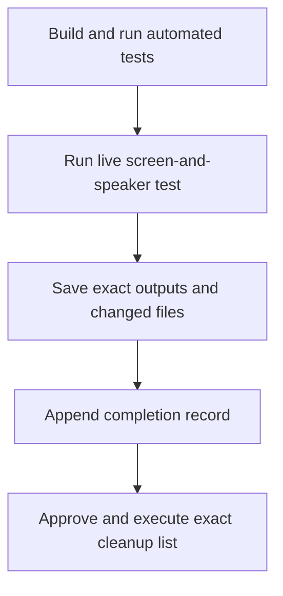

### L.4. Manifest, score, and report functions

**Files:** `include/shakti_manifest.h`, `src/shakti_manifest.c`, `include/shakti_score.h`, `src/shakti_score.c`, `include/shakti_report.h`, `src/shakti_report.c`, `data/eden/manifest.xml`, `data/eden/manifest_ledger.tsv`, `data/control/startup_report.txt`.

| No. | Function | Inputs | Output or state effect |
|---:|---|---|---|
| 1 | `shakti_manifest_init(shakti_manifest_t *manifest)` | Manifest | Resets fixed manifest state. |
| 2 | `shakti_manifest_load(shakti_manifest_t *manifest, const char *manifest_path)` | Manifest; XML path | Loads and validates ordered levels/tablets; returns completion. |
| 3 | `shakti_manifest_write_ledger(const shakti_manifest_t *manifest, const char *manifest_path, const char *ledger_path)` | Manifest; source path; output path | Audits tablets and writes the ledger; returns completion. |
| 4 | `shakti_manifest_print(const shakti_manifest_t *manifest)` | Manifest | Prints manifest status, levels, and tablets. |
| 5 | `trim_text`, `xml_unescape`, `extract_tag`, `extract_order` static | Manifest XML text and outputs | Parse bounded manifest fields and return match/completion status. |
| 6 | `is_absolute_path(const char *path)` static | Path | Returns absolute-path state. |
| 7 | `resolve_path(...)` static | Manifest path; relative path; output buffer | Writes resolved path; returns completion. |
| 8 | `find_level(...)` static | Manifest; level ID | Returns the matching level pointer. |
| 9 | `requirements_are_valid(...)` static | Manifest; requirement list; owner order | Returns ordered dependency status. |
| 10 | `validate_manifest(...)` static | Manifest | Returns complete manifest validity. |
| 11 | `write_ledger_text(FILE *file, const char *text)` static | Ledger stream; text | Writes ledger-safe text; returns completion. |
| 12 | `shakti_score_make(unsigned long passed, unsigned long required)` | Passed and required counts | Returns exact score, percent, and complete state. |
| 13 | `shakti_score_add(shakti_validation_score_t *total, const shakti_validation_score_t *part)` | Total; part | Adds one score into the total. |
| 14 | `shakti_score_format(const shakti_validation_score_t *score, char *destination, size_t destination_size)` | Score; output text; capacity | Writes readable score text; returns completion. |
| 15 | `shakti_report_init(shakti_report_t *report)` | Report | Resets report state. |
| 16 | `shakti_report_read_ledger(const char *ledger_path, shakti_report_t *report)` | Ledger path; report | Populates stone/tablet/check counts; returns completion. |
| 17 | `shakti_report_write(const char *report_path, const shakti_report_t *report, const shakti_school_state_t *school)` | Output path; report; School | Writes and flushes startup report; returns completion. |
| 18 | `shakti_report_print(const shakti_report_t *report, const shakti_school_state_t *school)` | Report; School | Prints exact startup status. |
| 19 | `shakti_report_run(...)` | Manifest, paths, School, output report | Builds ledger, reads totals, writes report, and returns completion. |
| 20 | `split_tabs`, `parse_ulong`, `count_tablet_state`, `write_report_body` static | Ledger/report fields | Parse ledger rows, update counts, and write report body. |

### L.5. Automated test functions and files

**Files:** `tests/test_shakti.c`, `tests/make_wav_fixture.c`, `tests/test_builder.sh`, `tests/test_loop.sh`, `tests/test_seed.sh`, `tests/test_mvp.sh`, `Makefile`, `verification/FRESH_VERIFICATION_2026-08-03.txt`.

| No. | Function | Inputs | Output or state effect |
|---:|---|---|---|
| 1 | `write_text_file(const char *path, const char *text)` static | Test path; fixture text | Writes a test fixture or stops the test on failure. |
| 2 | `test_exact_validation_score(void)` static | Fixed fixtures | Asserts score behavior. |
| 3 | `test_tick_order(void)` static | Fixed clock state | Asserts ordered tick behavior. |
| 4 | `test_text_log(void)` static | Temporary log | Asserts append and validation behavior. |
| 5 | `test_handwriting(void)` static | Fixed characters/text | Asserts 8×8 glyph behavior. |
| 6 | `test_asset_keys(void)` static | Fixed tokens | Asserts canonical asset filenames. |
| 7 | `test_memory_and_loop(void)` static | Temporary control files and runtime | Asserts memory, nine-route controls, reflection, and interrupts. |
| 8 | `test_reason_gate(void)` static | Fixed facts/evidence | Asserts deterministic decision gating. |
| 9 | `test_school_penalty(void)` static | School fixtures | Asserts streak, correction, and mastery state. |
| 10 | `test_sound_controlled_four_corner_frame(void)` static | Fixed stone and receipts | Asserts exact frame transitions and receipt rejection. |
| 11 | `test_real_counting_frames(void)` static | Staged counting tablet and artifacts | Asserts real counting-stone frame sequences. |
| 12 | `tests/test_shakti.c: main(void)` | Fixed test suite | Runs all C unit tests and returns process status. |
| 13 | `tests/make_wav_fixture.c` functions | Fixture parameters | Write deterministic little-endian WAV fixtures for adapter/tool tests. |

The current baseline shell test entrypoints define integration behavior that shall be transferred into C99 test runners:

| Baseline migration input | Required C99 replacement | Required proof |
|---|---|---|
| `tests/test_builder.sh` | `tests/2026_08_03_Shakti_L_Test_Builder.c` | XML builder, manifest, ledger, and runtime integration. |
| `tests/test_loop.sh` | `tests/2026_08_03_Shakti_L_Test_Loop.c` | Loop, reflection, interrupt, and resume integration. |
| `tests/test_seed.sh` | `tests/2026_08_03_Shakti_L_Test_Seed.c` | Foundation, counting, and alphabet curriculum generation. |
| `tests/test_mvp.sh` | `tests/2026_08_03_Shakti_L_Test_MVP.c` | Startup, isolated state, drill controls, and mastery. |

After the four C99 replacements pass the same assertions, add the four shell files to the exact approved cleanup list.

### L.6. Automated validation checklist

- [ ] `P1-TEST-001` Strict C99 build passes with warnings as errors.
- [ ] `P1-TEST-002` The C99 test harness passes all unit and migrated integration checks.
- [ ] `P1-TEST-003` Exact `one` sequence passes.
- [ ] `P1-TEST-004` Wrong completion filename is refused.
- [ ] `P1-TEST-005` Duplicate completion is refused.
- [ ] `P1-TEST-006` Early next-stone advancement is refused.
- [ ] `P1-TEST-007` All eleven counting stones validate their ordered sound sequences.
- [ ] `P1-TEST-008` Frame remains complete after final receipt.
- [ ] `P1-TEST-009` Interruption leaves Shakti awake.
- [ ] `P1-TEST-010` Reflection block activates at the governing approved-call point.

### L.7. Live validation checklist

- [ ] `P1-LIVE-001` A person sees `one.png` in the top-left.
- [ ] `P1-LIVE-002` A person sees `One` in the top-right while `one.wav` plays.
- [ ] `P1-LIVE-003` A person hears `o.wav` and sees `O`.
- [ ] `P1-LIVE-004` A person hears `n.wav` and sees `O N`.
- [ ] `P1-LIVE-005` A person hears `e.wav` and sees `O N E`.
- [ ] `P1-LIVE-006` A person hears the closing `one.wav` and sees the complete word.
- [ ] `P1-LIVE-007` The frame remains open until the closing sound completes.
- [ ] `P1-LIVE-008` The next stone starts once.
- [ ] `P1-LIVE-009` Save the observed screen-and-speaker result.

### L.8. Pass 1 closeout checklist

- [ ] `P1-CLOSE-001` Save compiler command and output.
- [ ] `P1-CLOSE-002` Save automated test commands and outputs.
- [ ] `P1-CLOSE-003` Save live observation evidence.
- [ ] `P1-CLOSE-004` Save the exact changed-file list.
- [ ] `P1-CLOSE-005` Verify the blueprint checksum remains unchanged.
- [ ] `P1-CLOSE-006` Append one completion record to Section VII.
- [ ] `P1-CLOSE-007` Record the exact restart point.
- [ ] `P1-CLOSE-008` Mark Pass 1 complete after all 74 required checklist rows pass.

### L.9. Current verified baseline

| Baseline item | Verified state |
|---|---|
| Strict C99 build | PASS |
| Current automated tests | PASS |
| Startup checks | `1033/1033` |
| Verified stones | `282/282` |
| Staged tablets | `7` |
| WAV padding | `74/74` compliant |
| Sound-controlled frame state | Implemented and unit tested |
| Real lesson connection | OPEN |
| Real audio adapter | OPEN |
| Real four-corner display adapter | OPEN |
| Real completion receipt | OPEN |
| Live screen-and-speaker Pass 1 | OPEN |
| Eden lock readiness | OPEN |

### L.10. Approval and cleanup law

After approval:

1. Record the Constitution SHA-256 outside the Constitution in the handoff manifest and Section VII.
2. Record the unchanged blueprint SHA-256.
3. Carry both files in every Pass 1 handoff.
4. Append amendments and completions only to Section VII.
5. Build an exact list of superseded notes.
6. Obtain approval for that exact deletion list.
7. Remove only the approved notes.
8. Verify the Constitution, blueprint, live source, assets, and evidence remain.

### L.11. Amendment register

`2026-08-03` — Section L adopted with 27 validation and closeout rows; Sections K and L contain 74 total checklist rows. Later Section L authority appends only to Section VII with tag `[L]`.

# VI. SCHEMAS, TEMPLATES, AND NAMING CONVENTIONS

## VI.A. Governing schema law

1. Use only C99 for executable project logic.
2. Use only XML for structured project schemas.
3. Use `SHAKTI_TABLET_4S_V2` for both current tablet forms: solo and crossed.
4. Keep one element per XML line for the restricted C99 parser.
5. Keep the four required channel tags exact: `text`, `written_text`, `sound_art`, `visual_art`.
6. Keep stone order positive, consecutive, and equal to the declared stone count.
7. Use only verified level-specific fields.
8. Add schema fields through one constitutional amendment, parser change, builder change, validator change, and test change.
9. Use PNG for new and migrated `visual_art` after the matching C99 PNG path passes.

## VI.B. Solo tablet schema

### VI.B.1. Variables

| Variable | Definition |
|---|---|
| `[LEVEL]` | Exact grounded curriculum level name. |
| `[LESSON]` | Exact solo lesson name. |
| `[STONE_COUNT]` | Positive number of ordered stones. |
| `[ORDER]` | Consecutive stone number beginning at `1`. |
| `[KEY]` | Case-sensitive canonical text and convergence basename. |
| `[SOUND_SEQUENCE]` | One grounded WAV or the ordered whole-word/letters/whole-word WAV list. |
| `[LEVEL_FIELDS]` | Verified tags required by that level, such as `alphabet_position`, `numeral`, or `quantity`. |

### VI.B.2. Template

```xml
<?xml version="1.0" encoding="UTF-8"?>
<tablet schema="SHAKTI_TABLET_4S_V2">
  <level>[LEVEL]</level>
  <lesson>[LESSON]</lesson>
  <stone_count>[STONE_COUNT]</stone_count>
  <stone order="[ORDER]">
    <text>[KEY]</text>
    <written_text>[KEY].8x8.txt</written_text>
    <sound_art>[SOUND_SEQUENCE]</sound_art>
    <visual_art>[KEY].png</visual_art>
    [LEVEL_FIELDS]
  </stone>
</tablet>
```

### VI.B.3. Solo training law

1. Present one complete new relationship.
2. Beginning at Level 2, introduce exactly one new parameter per first-exposure stone.
3. Ground every other parameter before use.
4. Finish and prove the solo lesson before crossing.

## VI.C. Crossed tablet schema

### VI.C.1. Variables

| Variable | Definition |
|---|---|
| `[CROSS_LESSON]` | Exact name of the grounded-root combination. |
| `[ROOT_A]`, `[ROOT_B]` | Exact grounded source keys. |
| `[COMPOSITE_KEY]` | Exact ordered composition of the grounded roots. |
| `[BRIDGE_KIND]` | Verified relationship name, such as `case_pair`. |
| `[RELATION_FIELDS]` | Verified fields that identify the grounded relationship. |

### VI.C.2. Template

```xml
<?xml version="1.0" encoding="UTF-8"?>
<tablet schema="SHAKTI_TABLET_4S_V2">
  <level>[LEVEL]</level>
  <lesson>[CROSS_LESSON]</lesson>
  <stone_count>[STONE_COUNT]</stone_count>
  <stone order="[ORDER]">
    <text>[COMPOSITE_KEY]</text>
    <written_text>[COMPOSITE_KEY].8x8.txt</written_text>
    <sound_art>[ROOT_A].wav|[ROOT_B].wav</sound_art>
    <visual_art>[COMPOSITE_KEY].png</visual_art>
    [RELATION_FIELDS]
    <bridge_kind>[BRIDGE_KIND]</bridge_kind>
  </stone>
</tablet>
```

### VI.C.3. Crossed training law

1. Cite the completion evidence for every included root.
2. Compose the crossed stone from the exact grounded roots.
3. Preserve root order, capitalization, character identity, sound identity, and relation fields.
4. Generate the visual and writing from grounded roots.
5. Validate every referenced atomic WAV independently.

## VI.D. MCP schemas

### VI.D.1. Resident message envelope

```xml
<epoch>
  <heartbeat>
    <interval></interval>
    <beats_left></beats_left>
  </heartbeat>
  <goal></goal>
  <notebook>
    <note></note>
    <reminder></reminder>
  </notebook>
  <menu></menu>
  <to_Tyler>
    <message></message>
    <note></note>
  </to_Tyler>
  <to_Shakti>
    <message></message>
    <note></note>
  </to_Shakti>
  <reflection></reflection>
</epoch>
```

### VI.D.2. Tool registry entry

```xml
<tool>
  <name>[TOOL_NAME]</name>
  <route>Gf</route>
  <parent>[TOOL_FAMILY]</parent>
  <description>[TOOL_DESCRIPTION]</description>
  <c_entrypoint>[C_ENTRYPOINT]</c_entrypoint>
  <registered>true</registered>
  <present>[TRUE_OR_FALSE]</present>
  <enabled>[TRUE_OR_FALSE]</enabled>
  <per_call_permission>required</per_call_permission>
  <input_schema>[INPUT_SCHEMA_ID]</input_schema>
  <receipt_schema>[RECEIPT_SCHEMA_ID]</receipt_schema>
</tool>
```

### VI.D.3. Tool-call and receipt transaction

```xml
<mcp_call>
  <event_id>[PHASE_A_EVENT_ID]</event_id>
  <capability>[TOOL_NAME]</capability>
  <registered>[TRUE_OR_FALSE]</registered>
  <present>[TRUE_OR_FALSE]</present>
  <enabled>[TRUE_OR_FALSE]</enabled>
  <per_call_permitted>[TRUE_OR_FALSE]</per_call_permitted>
  <input>[EXACT_INPUT]</input>
  <dispatch_tick>[PHASE_T_TICK]</dispatch_tick>
  <receipt>
    <opens>[PHASE_A_EVENT_ID]</opens>
    <completed_action>[EXACT_ACTION_OR_FILENAME]</completed_action>
    <completion_tick>[PHASE_Z_TICK]</completion_tick>
    <status>[PASS_OR_FAILURE_CODE]</status>
  </receipt>
</mcp_call>
```

All bracketed variables in VI.D shall be defined by the registry entry before the tool is enabled.

## VI.E. Log identity and file schema

### VI.E.1. Event identity

```text
[epoch_10]: [subsecond_3] [SectionUpper][subsectionLower]-[function_order_00_99] [phase_A_T_Z]
```

Example:

```text
1785108642: 184 Gf-01 A
1785108827: 191 Gf-04 Z opens=1785108642:184:Gf-01
```

| Element | Exact rule |
|---|---|
| `epoch_10` | Ten-digit epoch seconds. |
| `subsecond_3` | Three digits allocated in order inside the epoch second. |
| `SectionUpper` | One uppercase major section letter. |
| `subsectionLower` | One lowercase subsection letter. |
| `function_order_00_99` | Two digits from `00` through `99`. |
| `phase_A_T_Z` | Opening, doing, or closing phase. |
| `opens` | Required Phase Z reference to the Phase A identity. |

### VI.E.2. Runtime log fields

```text
PREFIX | EVENT_ID | PHASE | CHANNEL | SUBJECT | PROPERTY | VALUE | CHECKSUM
```

Every field is readable, bounded, and deterministically sanitized by C99. The event identity supplies record identity; the checksum supplies integrity evidence.

### VI.E.3. Dated log export name

```text
2026_08_[[xx]]_Shakti_[Section]_[name].log
```

Examples:

```text
2026_08_03_Shakti_A_Epoch.log
2026_08_03_Shakti_F_MCP_Tool_Calls.log
2026_08_03_Shakti_I_Reflection_Capsules.log
2026_08_03_Shakti_L_Pass_1_Evidence.log
```

## VI.F. WAV padding schema

### VI.F.1. Required C99 tool

Use `tools/pad_wav.c` through the compiled `pad_wav` executable.

### VI.F.2. Padding calculation

For each PCM WAV:

```text
padding_frames = ceil(sample_rate × 200 / 1000)
padding_bytes  = padding_frames × block_align
```

For 16 kHz mono 16-bit PCM:

```text
padding_frames = 3200
block_align     = 2
padding_bytes   = 6400 on each side
```

### VI.F.3. Padding process

1. Open the WAV in binary mode.
2. Verify RIFF/WAVE, PCM format, channel count, sample rate, 16-bit samples, block alignment, and data size.
3. Calculate the exact 0.2-second byte count.
4. Inspect the first and last padding ranges for zero-valued samples.
5. Preserve a compliant file unchanged.
6. For an unpadded file, write a temporary WAV containing the original header/chunks, leading zeros, original audio data, and trailing zeros.
7. Update the data-chunk and RIFF sizes.
8. Flush, close, atomically replace, and validate the completed WAV.
9. Record padded, already compliant, and failed counts.
10. Advance lessons from actual playback completion.

## VI.G. Convergence and visual naming

### VI.G.1. Canonical convergence set

```text
[KEY].8x8.txt
[KEY].wav
[KEY].png
```

The three files share the same case-sensitive `[KEY]`. The tablet’s `<text>` value preserves the exact human-readable identity.

For a spelled word:

```text
text=one
written_text=one.8x8.txt
sound_art=one.wav|o.wav|n.wav|e.wav|one.wav
visual_art=one.png
```

Each letter WAV belongs to its own grounded `o`, `n`, or `e` convergence.

### VI.G.2. Character-based writing

1. Resolve an internal word token to its ordered character sequence.
2. Look up each exact character in the fixed 8×8 atlas.
3. Emit characters in order.
4. Build the written-word artifact from those character glyphs.
5. Scale whole glyph cells to 32×32 or 64×64 while preserving the 8×8 source identity.

### VI.G.3. PNG dimensions

| Visual type | Canonical dimensions |
|---|---|
| Source character glyph | `8×8` |
| Writing display | `32×32` or `64×64` per character cell |
| Shape | `32×32` or `64×64` square |
| Symbol | `8×8`, `32×32`, or `64×64` square |
| Color swatch | `32×32` or `64×64` square |
| Counting object | `32×32`, with approved reduction to `16×16` or `8×8` when required by the count |
| Other picture | Square canvas whenever the subject permits; dimensions remain divisible by `8` |

### VI.G.4. Artifact separation

The repository shall keep implementation, schemas, and artifacts in separate roots:

```text
src/                         C99 runtime source
include/                     C99 public and internal headers
tools/                       C99 project tools
tests/                       C99 test programs and fixtures
schemas/                     XML schemas, tablets, manifests, registries, and records
artifacts/
  audio/wav/                 WAV convergence audio
  visual/png/                PNG visual referents
  writing/8x8/               Character-built 8×8 text artifacts
  logs/                      Runtime and exported logs
  ledgers/                   Deterministic validation ledgers
  evidence/                  Compiler, test, screen, and speaker proof
  documents/                 Non-governing generated documents
```

1. C99 files shall not be stored under `schemas/` or `artifacts/`.
2. XML files shall not be stored under C99 source roots or `artifacts/`.
3. Artifacts shall not be compiled, imported, or treated as executable instructions.
4. The Constitution and canonical blueprint remain governing root documents so every repository instruction can point to them directly.
5. Existing `eden_out/`, generated root reports, logs, ledgers, and archives are migration inputs. Move each verified item into the matching artifact class through a bounded work packet; do not bulk-move or delete.
6. Existing `data/` records shall be classified as XML schema/state or artifacts before any move. No classification is guessed.

## VI.H. Project naming convention

### VI.H.1. Required pattern

```text
2026_08_[[xx]]_Shakti_[Section]_[name].*
```

| Variable | Definition |
|---|---|
| `2026_08_[[xx]]` | Creation date; `[[xx]]` is the two-digit August day. |
| `Shakti` | Required project identity. |
| `[Section]` | Constitutional address `A`–`L` or controlled document class `Constitution`, `Schema`, `Template`, or `Log`. |
| `[name]` | Concise descriptive name using underscores. |
| `.*` | Exact required extension. |

Examples:

```text
2026_08_03_Shakti_Constitution_Pass_1_Master_Plan.md
2026_08_03_Shakti_J_PNG_Validator.c
2026_08_03_Shakti_J_PNG_Validator.h
2026_08_03_Shakti_L_Pass_1_Live_Evidence.txt
```

New project files follow this pattern. Locked authority files retain their verified names and bytes. Convergence assets follow VI.G so every modality shares the exact token basename.

### VI.H.2. Repository and branch naming

| Item | Rule |
|---|---|
| Sole main repository | `TylerALofall/shakti_eden-` |
| Default branch | `Shakti-main` |
| Work branch | `2026_08_[[xx]]_Shakti_[Section]_[name]` |
| Commit title | `[Section] [plan item IDs]: [completed action]` |
| Pull request title | `2026_08_[[xx]] Shakti [Section] — [bounded result]` |

## VI.I. Active code-file catalog

Every active baseline code file is assigned below.

### VI.I.1. C99 implementation register

This register includes the controlling handoff implementation. `include/shakti_frame.h`, `src/shakti_frame.c`, `tools/pad_wav.c`, and `verification/FRESH_VERIFICATION_2026-08-03.txt` are verified handoff inputs that are not present on the newest GitHub branch. They remain pending a separate source-admission work packet and are excluded from the cleanup tree count in VI.I.2.

| File | Constitutional ownership | Purpose |
|---|---|---|
| `src/main.c` | B–L | Runtime initialization, command routing, tool dispatch, status, report, and CLI modes. |
| `include/shakti_time.h`, `src/shakti_time.c` | A | Tick allocation and event formatting. |
| `include/shakti_log.h`, `src/shakti_log.c` | A, F–I | Append-only readable logs and validation. |
| `include/shakti_memory.h`, `src/shakti_memory.c` | C, D, I | Resident blocks, working/short-term memory, and recall. |
| `include/shakti_reason.h`, `src/shakti_reason.c` | F | Deterministic question, evidence, and decision gate. |
| `include/shakti_school.h`, `src/shakti_school.c` | J | Pass, drill, trial, glyph display, and School history. |
| `include/shakti_loop.h`, `src/shakti_loop.c` | A–I | Nine-route runtime state and control behavior. |
| `include/shakti_handwriting.h`, `src/shakti_handwriting.c` | J | Fixed character atlas and written-text artifacts. |
| `include/shakti_asset.h`, `src/shakti_asset.c` | J | Canonical convergence keys and safe filenames. |
| `include/shakti_artifact.h`, `src/shakti_artifact.c` | J | Artifact paths and written-text/WAV validation; legacy SVG migration and required PNG validation. |
| `include/shakti_frame.h`, `src/shakti_frame.c` | J | Sound-controlled four-corner frame state. |
| `include/shakti_tablet.h`, `src/shakti_tablet.c` | J | V2 tablet parser, channel validation, load, audit, and display. |
| `include/shakti_manifest.h`, `src/shakti_manifest.c` | J, L | Ordered curriculum manifest and ledger. |
| `include/shakti_score.h`, `src/shakti_score.c` | L | Exact validation scores. |
| `include/shakti_report.h`, `src/shakti_report.c` | L | Startup report and verified counts. |
| `include/shakti_config.h` | A–L | Fixed paths, capacities, thresholds, reflection limits, and heartbeat range. |
| `include/shakti_types.h` | A–L | All fixed runtime enums and structures. |
| `tools/build_xml.c` | J | Generic C99 tablet builder. |
| `tools/build_seed_curriculum.c` | J | Foundation, counting, alphabet, and crossing builder. |
| `tools/pad_wav.c` | J | Dependency-free 0.2-second WAV edge padding. |
| `tools/build_ledger.c` | L | Manifest ledger builder. |
| `tests/test_shakti.c` | K, L | C99 unit and real-fixture tests. |
| `tests/make_wav_fixture.c` | J, L | Deterministic WAV test fixture. |
| `tests/test_builder.sh` | L migration input | Transfer builder integration assertions into C99, then place this file on the approved cleanup list. |
| `tests/test_loop.sh` | L migration input | Transfer loop integration assertions into C99, then place this file on the approved cleanup list. |
| `tests/test_seed.sh` | L migration input | Transfer curriculum assertions into C99, then place this file on the approved cleanup list. |
| `tests/test_mvp.sh` | L migration input | Transfer startup and School assertions into C99, then place this file on the approved cleanup list. |
| `Makefile` | K, L | Repository build metadata limited to invoking the C99 compiler, C99 binaries, XML inputs, and artifact paths. |

### VI.I.2. Complete repository file accounting

The cleanup source is consolidated `Shakti-main` at `9a9e10c284a1c26334cb9b95d36a67e3e00fc050`. The cleanup work branch is `copilot/tmz-7th-toile-merge-branches`, which began identical to that commit.

The completed cleanup tree shall contain exactly the active paths in VI.I.2.a, the preserved historical paths in VI.I.2.b, and the artifact groups in VI.I.2.c. Every path belongs to one register.

External Library and handoff authority files named elsewhere in this Constitution are inputs, not paths in this cleanup tree. They enter the repository only through a later named source-admission work packet.

#### VI.I.2.a. Active useful paths

```text
.gitattributes
.github/copilot-instructions.md
.gitignore
2026_08_03_Shakti_Constitution_Pass_1_Master_Plan.md
CHANGELOG.md
Makefile
README.md
data/control/goal.txt
data/control/menu.txt
data/control/messages.log
data/control/notebook.log
data/control/reflections.log
data/control/startup_report.txt
data/eden/XML_text/00_ascii_32_126_solo.xml
data/eden/XML_text/01_counting_zero_to_ten_solo.xml
data/eden/XML_text/01_counting_zero_to_ten_timed_light.xml
data/eden/XML_text/02_alphabet_case_pairs_and_counting.xml
data/eden/XML_text/02_alphabet_growing_sequences.xml
data/eden/XML_text/02_alphabet_lowercase_solo.xml
data/eden/XML_text/02_alphabet_uppercase_solo.xml
data/eden/eden_facts.txt
data/eden/eden_stream.log
data/eden/manifest.xml
data/eden/manifest_ledger.tsv
data/eden/thesaurus.txt
data/learned/evidence.log
data/learned/learned_stream.log
data/notebook/.gitkeep
data/quarantine/.gitkeep
data/school/school_state.log
data/school/symbols.txt
data/source/MISSING_FOUNDATION_SOUNDS.tsv
data/source/counting_zero_to_ten.tsv
data/source/foundation_ascii_32_126.tsv
data/source/sound_stage_manifest.tsv
include/shakti_artifact.h
include/shakti_asset.h
include/shakti_config.h
include/shakti_handwriting.h
include/shakti_log.h
include/shakti_loop.h
include/shakti_manifest.h
include/shakti_memory.h
include/shakti_reason.h
include/shakti_report.h
include/shakti_school.h
include/shakti_score.h
include/shakti_tablet.h
include/shakti_time.h
include/shakti_types.h
src/main.c
src/shakti_artifact.c
src/shakti_asset.c
src/shakti_handwriting.c
src/shakti_log.c
src/shakti_loop.c
src/shakti_manifest.c
src/shakti_memory.c
src/shakti_reason.c
src/shakti_report.c
src/shakti_school.c
src/shakti_score.c
src/shakti_tablet.c
src/shakti_time.c
tests/make_wav_fixture.c
tests/test_builder.sh
tests/test_loop.sh
tests/test_mvp.sh
tests/test_seed.sh
tests/test_shakti.c
tools/build_ledger.c
tools/build_seed_curriculum.c
tools/build_xml.c
```

The four shell test entrypoints remain temporarily because the current `Makefile` invokes them. Section L moves them to `old/tests/` only after their C99 replacements pass the same assertions and the `Makefile` points to the replacements.

#### VI.I.2.b. Preserved historical paths under root `old/`

| Original path | Preserved path | Classification reason |
|---|---|---|
| `.github/instructions/training-docs.instructions.md` | `old/.github/instructions/training-docs.instructions.md` | Its valid rules are incorporated into this Constitution; the active repository uses one instruction pointer. |
| `SHAKTI_LOCK_V1_1.md` | `old/SHAKTI_LOCK_V1_1.md` | Its valid authority is incorporated into this Constitution; it remains preserved as source evidence. |
| `docs/ALPHABET_V1.md` | `old/docs/ALPHABET_V1.md` | Historical lesson document; runtime uses the active XML tablet and C99 loader. |
| `docs/DRILL_CONTROL_AND_TEST_ISOLATION.md` | `old/docs/DRILL_CONTROL_AND_TEST_ISOLATION.md` | Historical implementation note; live C99 tests and `CHANGELOG.md` carry current behavior. |
| `docs/FOUNDATION_COUNTING_V1.md` | `old/docs/FOUNDATION_COUNTING_V1.md` | Historical lesson document; runtime uses the active XML tablet and C99 loader. |
| `docs/MANIFEST_LEDGER_V1.md` | `old/docs/MANIFEST_LEDGER_V1.md` | Historical implementation note; active C99 manifest, ledger, and tests control. |
| `docs/MASTER_ARCHITECTURE.md` | `old/docs/MASTER_ARCHITECTURE.md` | Superseded architecture evidence preserved beneath `old/`. |
| `docs/REVISION_5_REVIEW.md` | `old/docs/REVISION_5_REVIEW.md` | Revision 5 is historical evidence and carries no active authority. |
| `docs/SHAKTI_MCP_REVIEW_AND_BLUEPRINT.md` | `old/docs/SHAKTI_MCP_REVIEW_AND_BLUEPRINT.md` | Earlier C17 MCP proposal conflicts with the current C99 Constitution and remains preserved as evidence. |
| `docs/SINGLE_PROCESS_BOUNDARY.md` | `old/docs/SINGLE_PROCESS_BOUNDARY.md` | Historical boundary note; the active rule is incorporated into this Constitution and current C99 source. |
| `backup/SHAKTI_GITHUB_READY_C99.zip` | `old/backup/SHAKTI_GITHUB_READY_C99.zip` | Pull request 2 preserved the archive artifact beneath `old/backup/`. |
| `backup/SHAKTI_RUNNABLE_MVP_C99_SOURCE 3.zip` | `old/backup/SHAKTI_RUNNABLE_MVP_C99_SOURCE 3.zip` | Pull request 2 preserved the archive artifact beneath `old/backup/`. |
| `copilot/branch-name-8:README.md` | `old/branches/copilot__branch-name-8/README.md` | Pull request 2 preserved the unique branch-only README. |
| `copilot/branch-name-8:SHAKTI_RUNNABLE_MVP_C99_FIX_1_SOURCE 2.zip` | `old/branches/copilot__branch-name-8/SHAKTI_RUNNABLE_MVP_C99_FIX_1_SOURCE 2.zip` | Pull request 2 preserved the unique branch-only archive. |
| `copilot/branch-name-8:shakti_eden-three-branches.bundle` | `old/branches/copilot__branch-name-8/shakti_eden-three-branches.bundle` | Pull request 2 preserved the unique branch bundle. |
| Pull request 2 consolidation record | `old/CONSOLIDATION_MANIFEST.xml` | Records branch identities, exact blob decisions, moves, duplicates, and validation results. |

#### VI.I.2.c. Artifact groups preserved in place

| Artifact group | Exact accounting | Rule |
|---|---:|---|
| `eden_out/**` | 507 files | Preserve unchanged for the separate PNG/WAV/8×8 migration work; this cleanup does not inspect or move individual sensory artifacts. |
| Root validation outputs | 5 files | Preserve `BUILD_TEST_REPORT.txt`, `CHECK_RUN_OUTPUT.txt`, `DEMO_RUN_OUTPUT.txt`, `DRILL_RUN_OUTPUT.txt`, and `MANIFEST.sha256` unchanged as evidence artifacts. |

Accounting after cleanup:

```text
73 active useful paths
16 preserved paths under old/
512 artifact and evidence paths preserved in place
601 total repository paths
```

## VI.J. Required templates

### VI.J.1. Work packet

```text
WORK_PACKET_ID=
DATE=
REPOSITORY=
BRANCH=
BASE_COMMIT=
SOURCE_ROOT=
XML_ROOT=
ARTIFACT_ROOT=
CONSTITUTION_SECTIONS=
PLAN_ITEM_IDS=
INPUT_FILES=
OUTPUT_FILES=
FUNCTIONS=
STATE_INPUTS=
EXPECTED_OUTPUTS=
VALIDATORS=
EVIDENCE_PATHS=
BLOCKERS=
RESTART_POINT=
```

### VI.J.2. Function contract

```text
FUNCTION=
VISIBILITY=PUBLIC|STATIC
DECLARATION_FILE=
DEFINITION_FILE=
INPUTS=
OUTPUT_POINTERS=
RETURN=
STATE_EFFECTS=
FILES_READ=
FILES_WRITTEN=
FAILURE_RESULTS=
VALIDATORS=
```

### VI.J.3. Completion record

```text
COMPLETION_ID=
DATE=
MODEL=
EPOCH=
CONSTITUTION_SECTIONS=
PLAN_ITEM_IDS=
REPOSITORY=
BRANCH=
BASE_COMMIT=
FILES_CHANGED=
FUNCTIONS_CHANGED=
VALIDATORS=
ACTUAL_RESULTS=
EVIDENCE_PATHS=
STATUS=
BLOCKERS=
NEXT_ITEM=
RESTART_POINT=
```

### VI.J.4. Amendment record

```text
AMENDMENT_ID=
DATE=
MODEL=
SECTIONS=
FILES=
CHANGE=
AUTHORITY=
VALIDATORS=
RESULTS=
EVIDENCE_PATHS=
SUPERSEDES=
```

### VI.J.5. Cleanup approval list

```text
CLEANUP_LIST_ID=
DATE=
BASELINE=
TARGET_PATHS=
REASON_PER_PATH=
PRESERVED_AUTHORITY=
PRESERVED_SOURCE=
PRESERVED_ASSETS=
PRESERVED_EVIDENCE=
APPROVED_BY=
APPROVAL_DATE=
ACTUAL_RESULTS=
```

### VI.J.6. Repository instruction pointer

Place this Constitution at the repository root. Replace `.github/copilot-instructions.md` with exactly:

```text
# SHAKTI PROJECT AUTHORITY
Read and obey `/2026_08_03_Shakti_Constitution_Pass_1_Master_Plan.md` before acting on this repository.
```

The pointer adds no rules, exceptions, summaries, or interpretations. The NOTICE and all controlling instructions live in this Constitution.

All valid content from `.github/instructions/training-docs.instructions.md` and `SHAKTI_LOCK_V1_1.md` is represented here. Preserve both source files beneath `old/` at the exact paths in VI.I.2.b and keep this pointer as the sole active repository instruction.

## VI.K. GitHub governance to approve before activation

The following rules shall be finalized in Section VII before repository settings change:

1. Keep `TylerALofall/shakti_eden-` as the sole active main repository.
2. Consolidate verified source into `Shakti-main` through bounded branches and pull requests.
3. Protect `Shakti-main` from force pushes and deletion.
4. Require the strict C99 build, XML schema validation, and C99 test suite before merge.
5. Add a C99 policy check that reports every unauthorized language file or invocation touching project files.
6. Require every pull request to name constitutional sections, plan items, files, functions, validators, and evidence.
7. Preserve the canonical blueprint checksum.
8. Archive superseded repositories only after source, history, and unique files are inventoried and approved.
9. Use `Shakti-main` commit `9a9e10c284a1c26334cb9b95d36a67e3e00fc050`, containing the pull request 2 consolidation, as the repository evidence baseline until a later Section VII record advances it.
10. Bring this Constitution to the root before replacing `.github/copilot-instructions.md` with VI.J.6.
11. Do not merge the long instruction bodies from `copilot/add-copilot-instructions-file`; move their valid rules here and keep only the pointer.
12. Keep artifacts under VI.G.4 and outside all C99 and XML roots.

These settings require direct values before activation:

| Variable | Required decision |
|---|---|
| `[GITHUB_REQUIRED_APPROVALS]` | Number of approving reviews required. |
| `[GITHUB_ADMIN_BYPASS]` | Whether Tyler may bypass a blocked rule. |
| `[GITHUB_MERGE_METHOD]` | Merge commit, squash, or rebase. |
| `[GITHUB_REQUIRED_CHECKS]` | Exact check names enforced by GitHub. |
| `[GITHUB_BRANCH_DELETE]` | Whether merged work branches delete automatically. |
| `[GITHUB_ARCHIVE_LIST]` | Exact repositories to archive after consolidation. |

# VII. AMENDMENTS | LOG

## VII.A. Append-only command

After approval, append every constitutional change and every Pass 1 completion below the final existing record. Preserve Sections I–VI and every earlier Section VII record.

## VII.B. Amendment records

### AMENDMENT `2026_08_03-CODEX-GPT5-CONSTITUTION-001`

```text
AMENDMENT_ID=2026_08_03-CODEX-GPT5-CONSTITUTION-001
DATE=2026-08-03
MODEL=Codex (GPT-5)
SECTIONS=I, II, III, IV, V-A, V-B, V-C, V-D, V-E, V-F, V-G, V-H, V-I, V-J, V-K, V-L, VI, VII
FILES=2026_08_03_Shakti_Constitution_Pass_1_Master_Plan.md
CHANGE=Rebuilt the Pass 1 master plan as one constitutional document with Roman-numeral authority sections, matching A-L code sections, definitions, flow charts, subsection indexes, function inputs and outputs, 74 checklist rows, templates, and append-only amendment law.
AUTHORITY=Direct instruction dated 2026-08-03 and the verified canonical blueprint.
VALIDATORS=Heading audit; A-L section audit; checklist count; function/file catalog audit; copied-chat audit.
RESULTS=REVIEW_DRAFT_CREATED
EVIDENCE_PATHS=This constitutional file.
SUPERSEDES=SHAKTI_PASS_1_MASTER_PLAN.md after Tyler approval.
```

### AMENDMENT `2026_08_03-CODEX-GPT5-CONSTITUTION-002`

```text
AMENDMENT_ID=2026_08_03-CODEX-GPT5-CONSTITUTION-002
DATE=2026-08-03
MODEL=Codex (GPT-5)
SECTIONS=I, IV, V-J, V-K, V-L, VI, VII
FILES=2026_08_03_Shakti_Constitution_Pass_1_Master_Plan.md
CHANGE=Added constitutional authority language; C99 and XML language boundary; absolute Python exclusion including file reads; sole main repository location; solo and crossed tablet schemas; one-new-parameter grounding law beginning at Level 2; character-based writing; internal word tokens; PNG convergence migration; square 8x8, 32x32, and 64x64 visual rules; exact 0.2-second WAV padding process; MCP transaction schema; log identity; convergence filenames; GitHub governance; and C99 migration for four shell test entrypoints.
AUTHORITY=Direct instructions dated 2026-08-03, canonical blueprint, verified live V2 tablets, live C99 source, and verified GitHub repository metadata.
VALIDATORS=Repository identity check; schema comparison; live XML inspection; C signature inventory; WAV padding source inspection; naming audit.
RESULTS=REVIEW_DRAFT_UPDATED
EVIDENCE_PATHS=This constitutional file; SHAKTI_COMPLETE_HANDOFF_V1.zip; https://github.com/TylerALofall/shakti_eden-
SUPERSEDES=
```

### AMENDMENT `2026_08_03-CODEX-GPT5-CONSTITUTION-003`

```text
AMENDMENT_ID=2026_08_03-CODEX-GPT5-CONSTITUTION-003
DATE=2026-08-03
MODEL=Codex (GPT-5)
SECTIONS=I, IV, V-J, V-K, V-L, VI, VII
FILES=2026_08_03_Shakti_Constitution_Pass_1_Master_Plan.md
CHANGE=Separated artifacts from C99 source and XML schemas; defined the artifact root and class directories; inspected the most recent merged copilot source branch and the separate unmerged instruction branch; moved the valid notice into the Constitution; defined one exact repository instruction pointer; and made PNG the required Pass 1 visual target while retaining SVG only as bounded migration input.
AUTHORITY=Direct instructions dated 2026-08-03; verified GitHub main commit 54b7ee5b567e055f42fd73e7887486db0b6185f4; copilot/organize-project-structure; and inspected instruction evidence from copilot/add-copilot-instructions-file.
VALIDATORS=GitHub branch comparison; pull-request file inventory; instruction-file inspection; artifact-boundary audit; PNG-reference audit; checklist-count audit.
RESULTS=REVIEW_DRAFT_UPDATED
EVIDENCE_PATHS=This constitutional file; https://github.com/TylerALofall/shakti_eden-/pull/1; https://github.com/TylerALofall/shakti_eden-/tree/copilot/add-copilot-instructions-file
SUPERSEDES=Long repository and training instruction bodies after Tyler approves their exact replacement or non-merge list.
```

### AMENDMENT `2026_08_03-CODEX-GPT5-CONSTITUTION-004`

```text
AMENDMENT_ID=2026_08_03-CODEX-GPT5-CONSTITUTION-004
DATE=2026-08-03
MODEL=Codex (GPT-5)
SECTIONS=I, V-K, V-L, VI, VII
FILES=2026_08_03_Shakti_Constitution_Pass_1_Master_Plan.md
CHANGE=Confirmed copilot/add-copilot-instructions-file as the newest branch; established root old/ as the recoverable historical-file destination; classified every repository path; listed every active useful path; listed every historical move with its original and preserved path; and accounted for unchanged sensory, archive, and validation artifacts by exact group and count.
AUTHORITY=Tyler's direct repository-accounting and root/old instructions dated 2026-08-03; GitHub branch heads; current Makefile dependencies; current C99 path constants; and the complete pull-request 1 file inventory.
VALIDATORS=Branch-head date comparison; 598-path accounting equation; Makefile dependency inspection; C99 path-reference inspection; active-path register audit; old-path register audit; artifact-group count audit.
RESULTS=REPOSITORY_ACCOUNTING_LOCKED_FOR_CLEANUP_BRANCH
EVIDENCE_PATHS=This constitutional file; https://github.com/TylerALofall/shakti_eden-/tree/copilot/add-copilot-instructions-file
SUPERSEDES=
```

## VII.C. Completion records

Append the first Pass 1 completion record below this line after approval and execution.
